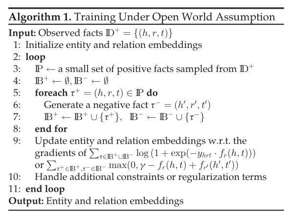
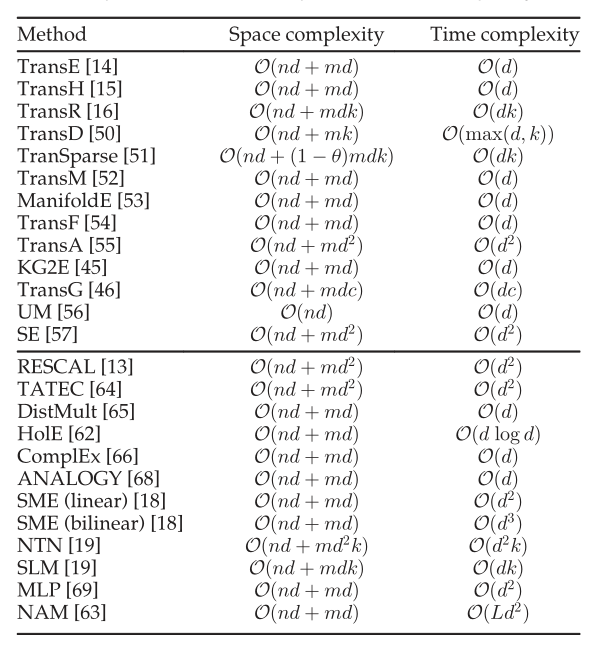

### Knowledge Graph Embedding A Survey of Approaches and Applications 2017

#### 大体目录

1.介绍

2.简要介绍了基本符号

==3.回顾了仅使用在KGs中观察到的事实进行嵌入的技术==

==4.讨论嵌入技术，进一步结合其他信息之外的事实==

5.进一步探讨了KG嵌入在KG完成、关系提取、问题回答等下游任务中的应用

6.总结

#### 1.知识图的简介

KG是一个由实体(节点)和关系(不同类型的边)组成的多关系图。每条边都被表示为三种形式(头实体、关系、尾实体)，也被称为事实，表示两个实体通过特定的关系连接。

#### 2.目前存在的问题

虽然在表示结构化数据方面很有效，但这种三元组的潜在符号性质通常使KGs难以操纵。

#### 3.如何解决以及基本思想

为了解决这个问题，一个被称为知识图嵌入的新研究方向被提出并迅速获得了广泛的关注。其关键思想是将包含实体和关系的KG组件嵌入到连续向量空间中，从而在保持KG固有结构的同时简化操作。这些实体和关系嵌入可以进一步用于各种任务，如KG完成、关系提取、实体分类和实体解析。

#### 4.仅使用事实的技术的KG嵌入技术

##### (1)Translational Distance Models

总述：平移距离模型利用基于距离的评分函数。它们用两个实体之间的距离来衡量一个事实的合理性，通常是在关系进行平移之后。

1）TransE and Its Extensions

2）Gaussian Embeddings

3）Other Distance Models

##### (2)Semantic Matching Models

总述：语义匹配模型利用基于相似度的评分函数。它们通过匹配在向量空间表示中体现的实体和关系的潜在语义来衡量事实的合理性。

1)RESCAL and Its Extensions

2)Matching with Neural Networks

##### (3)Model Training

1)开放世界假设下的训练

2)封闭世界假设下的训练

3)模型在空间和时间复杂度方面的比较

#### 5.合并其他信息的KG嵌入技术

附加信息有：

(1)Entity Types

(2)Relation Paths

(3)Textual Descriptions

(4)Logical Rules

(5)Other Information

#### 6.应用

##### (1)In-KG Applications

In-KG应用是指在KG的范围内进行的应用，其中学习实体和关系嵌入。我们介绍了链路预测、三重分类、实体分类和实体解析四种应用。

1)Link Prediction

2)Triple Classification

3)Entity Classification

4)Entity Resolution

##### (2)Out-of-KG Applications

1)Relation Extraction

关系抽取的目的是从已经检测到实体的纯文本中提取关系事实。

2)Question Answering

3)Recommender Systems

#### 7.总结

KG嵌入是将实体和关系嵌入到连续的向量空间中，在各种面向实体的任务中得到了重要的应用，并迅速得到了广泛的关注。本文对目前可用的技术进行了系统的回顾，特别是基于KG嵌入信息的类型。首次引入了仅利用在给定KG中观察到的事实进行嵌入的先进技术。我们描述了总体框架，具体的模型设计，典型的培训程序，以及这些技术的优缺点。在此基础上，进一步探讨了将KG嵌入事实之外的其他信息的先进技术。我们特别关注了四种类型的附加信息的合并，即实体类型、关系路径、文本描述和逻辑规则。有关补充信息的调查刚刚开始，在不久的将来可能会受到越来越多的关注。最后，本文探讨了KG嵌入的应用。引入了两种类型的应用程序，即在输入KG范围内执行的in-KG应用程序和扩展到更广泛领域的out-  KG应用程序。

