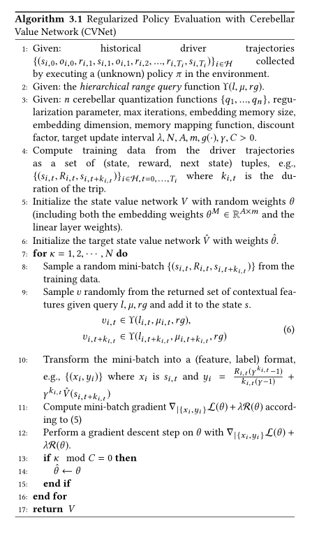

### A Deep Value-network Based Approach for Multi-Driver Order  Dispatching

#### 目录：

1.简介

2.介绍 smdp 公式，并强调标准 mdp的区别

3.介绍了 lipschitz 规则化策略评估和 cvnet 结构，以及上下文随机化技术在特征学习中的应用

4.讨论如何将这个神经网络嵌入到一个组合问题中，以便在有成千上万驱动程序的在线多智能体环境中进行策略改进

5.讨论了迁移学习在电网调度系统中的应用

6.实验结果

7.总结

#### 1.目前算法以及缺点：

(1)先前的工作==忽略了空间和时间维度上的全局最优性==，例如，要么以局部贪婪的方式将最近的司机分配给乘客，要么以先到先得的方式进行匹配。

(2)最近的两项工作通过明确考虑订单分派模型中的时空最优性而脱颖而出。采用了一种学习和规划方法，其中离线学习步骤使用动态规划在离散的表格时空空间中执行时间差(td)更新，而在线规划步骤使用学习步骤中的表格值通过求解一个组合优化来计算实时匹配。虽然已经在滴滴出行的生产系统中成功部署了该算法，并报告在基线上取得了显著的改进，==但表格方法的局限性是显而易见的，例如，无法概括历史培训数据以外的信息，也不可能对不同的供需条件作出实时反应。==

(3)另一项工作采用了一种基于Q-learning的深度强化学习方法，即使用深度神经网络来估计驱动程序的状态-动作值函数。从单一驾驶员的角度来看，强化学习经纪人接受了培训，以便根据历史数据最大限度地提高每天的总收入。为了提高强化学习的样本复杂度，提出了一种新的订单分配转移学习方法，利用多个城市之间的知识转移。证明了深层神经网络在单个驾驶员的长期收入最大化中的成功应用，但==该方法在需要多个代理协调的生产调度系统中的应用本质上是不充分的。==

#### 2.本文的改进以及创新之处

一种基于深层神经网络的订单分派方法，通过滴滴的拼车平台，实现了大规模在线 a/b 测试结果的显著改善。提出了在多司机指令调度环境下最大化长期司机总收入的方法。

#### 3.多司机调度规划

基于小脑值网络(cvnet)的规则化策略评估算法

#### 4.实验

**实验名称**：Order Dispatching Experiments

**实验目的：**实验验证了 cvnet 在动态复杂的多驾驶员环境下提高驾驶员总收入的能力。

**数据：**使用从滴滴平台收集的真实数据进行模拟验证 cvnet

**Baseline：**以  ρi 为驾驶员-指令对之间的负距离，最大化当前批量调度率的近视方法。

**实验创新之处：**

使用了更简单的小脑嵌入层(没有层次的扁平六边形网格) ，没有上下文特征。最终值也以查找表格式存储，供模拟器使用。与 tval  的主要区别在于使用了神经网络作为函数逼近。这样就可以对 cvnet 进行消融分析。

本文提出的方法采用三层六边形网格层。使用了四个额外的上下文特性，包括一个静态特性，一天/一周，和三个动态特性，包括行程查询，顺序和空驱动程序计数在最后一分钟的邻居。

**实验结果：**

通过 didi 的平台进行真实世界的实验，并在线报告 a/b  测试结果见表2。本文在实验的基础上，与中国三个城市的在线生产调度政策进行了比较。实验的设计和安装类似于[19]。除了司机总收入，我们报告两个额外的指标，包括订单答复率和订单完成率。结果载于表2。我们注意到，在所有三个试验城市中，所有指标的生产基线都有0.5%-2%  的提高。顺序应答率的增加意味着，随着时间的推移，驱动程序的分布已经优化，以便更好地与订单可能出现的地方保持一致，因为如果在其邻近地区没有空的驱动程序(通常半径为2公里)  ，则订单请求将不会得到应答，而且驱动程序的数量不受调度政策的影响。完成率的增加表明订单回复后取消行程的次数减少了。他们一起表明 cvnet  改善了平台的驾驶员收入和用户体验。

#### 5.全文总结

本文提出了一种基于深度强化学习的订单分派解决方案。该方法通过滴滴的乘车调度平台，在大规模的在线  a/b  测试中，显著提高了司机总收入和用户体验相关指标。首先，针对订单调度问题，提出了一种新的订单调度模型，该模型考虑了订单调度的时间扩展行为。其次，提出了一种新的网络结构——小脑值网络(cvnet)  ，并在此基础上提出了一种新的 lipschitz 正则化方案，以保证策略评估过程中值迭代的鲁棒性和稳定性。实际数据的实验表明，cvnet  对异常值具有较强的鲁棒性，并能很好地推广到未见数据。大量模拟和在线 a/b 测试结果表明，cvnet  优于所有其他调度策略。最后，我们表明，使用迁移学习可以进一步改善以前的结果，并促进跨城市规模的 cvnet。

