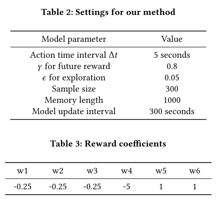

### A Reinforcement Learning Approach for Intelligent Traffic Light Control

#### 目录：

##### 1.介绍

##### 2.讨论文献

##### 3.问题定义

##### 4.具体方法

##### 5.实验结果

##### 6.总结论文

#### 1.背景

根据福布斯2014年的一份报告，交通堵塞每年给美国人造成1240亿美元的损失。在欧盟，交通堵塞成本估计为 gdp 的1%  。改善交通条件可以提高城市效率，改善经济，缓解人们的日常生活。

#### 2.目前存在的问题

##### （1）现实中的缺点：

减少交通堵塞的方法之一是智能控制交通灯。如今，大多数交通灯仍然是按照预先定义的固定时间图控制的，而且没有根据实际交通情况进行设计。最近的研究建议根据真实的交通数据手工制定规则。然而，这些规则仍然是预先定义的，不能动态调整  w.r.t. 实时流量。

##### （2）传统算法的缺点：

传统的强化学习很难应用，主要有两个方面的挑战: (1)如何表示环境;  (2)如何建立环境与决策之间的关系模型。为了应对这两个挑战，最近的研究已经应用深度强化学习技术，如深度 q-learning (dqn)  ，来解决交通灯控制问题。

#### 3.深度强化学习的基本思想

深度强化学习框架的基本思想：交通环境由交通灯相位和交通条件组成。状态是环境的特征表现。代理以状态作为输入，学习一个模型来预测是否“保持交通灯的当前相位”或“改变当前相位”。决策被发送到环境中，奖励(例如，有多少车辆通过路口)被发送回代理。代理因此更新模型，并进一步根据新的状态和更新的模型为下一个时间戳做出新的决策。

#### 4.算法介绍

##### （1）以前使用的算法：

早期的交通灯控制方法大致可分为两类。第一种是预计时信号控制，根据历史交通需求确定所有绿灯的固定时间，而不考虑交通需求可能出现的波动。第二种是使用实时交通信息的车辆驱动控制方法。车辆驱动方法适用于具有较高交通随机性的场合。然而，这种方法很大程度上取决于当前交通状况的手工规则，而没有考虑将来的情况。因此，它不能达到全局最优。

##### （2）交通灯控制强化学习

#### 5.实验

##### （1）实验平台：

实验在模拟平台SUMO  (simulation of Urban  MObility)2上进行。SUMO为路网设计、交通量模拟和交通灯控制提供了灵活的api。具体来说，SUMO可以根据给定的交通灯策略(由交通灯代理获得)来控制交通的移动。

##### （2）参数设置和奖励系数

##### （3）评价指标

Reward

Queue length

Delay

Duration

==奖励越高，表明该方法的性能越好，而队列长度、延迟和持续时间越小，表明流量越不拥挤。==

##### （4）比较的方法以及baseline

Fixed-time Control (**FT**)：固定时间控制方法采用预先确定的周期和相位时间计划，在交通流稳定时被广泛应用。

Self-Organizing Traffic Light Control (**SOTL**)：该方法根据当前的交通状态，包括重叠时间和等待红灯的车辆数量来控制交通灯。具体来说，当等候车辆的数量超过手动调节的阈值时，交通灯就会改变。

Deep Reinforcement Learning for Traffic Light Control (**DRL**).应用DQN框架选择交通交叉口的最优光配置。具体来说，它只依赖于原始的交通信息作为图像。

==模型的变体：==

IntelliLight(**Base**)：使用相同的网络结构和奖励函数。这种方法没有记忆宫殿和相门。

IntelliLight(**Base+MP**)：通过将心理学中的Memory  Palace添加到intelllight - base中，我们将来自不同阶段和时间的样本存储在不同的记忆中。

IntelliLight(**Base+MP+PG**)：这是添加了两种技术(记忆宫殿和相门)的模型。

##### (5)数据

合成数据。在我们实验的第一部分中，合成数据使用了四种交通流设置:简单改变流量(配置1)、等速稳定流量(配置2)、非等速稳定流量(配置3)和复杂流量(配置4)，复杂流量是前三种配置的组合。

现实世界的数据。真实世界数据集由中国济南1704个监控摄像头收集，时间跨度为2016年8月1日至2016年8月31日。

##### (6)在合成数据上的性能

1.与最先进的方法进行比较。我们首先将我们的方法与其他三个基线在不同的合成流量设置下进行比较。

2.与我们提出的方法的变体进行比较

##### (7)在真实数据上的性能

在真实数据上比较我们的方法与基线方法。我们的方法dintelllight在所有比较方法中获得了最佳奖励、队列长度、延迟和持续时间，相对于最佳基线方法，相应提高了32%、38%、19%和22%。此外，我们的方法在多个交叉口上具有相对稳定的性能(标准差小)。

我们将对从实际数据中了解到的策略进行观察。我们分析了经流路(WEdirection)和二环西辅路(SN  direction)交叉口在**高峰时段与非高峰时段**、**工作日与周末**、**主干道与次要干道**不同场景下的交通灯策略。

#### 总结

使用一种精心设计的强化学习方法来解决交通信号灯控制问题。进行了广泛的实验，使用合成和真实世界的实验，并证明了我们提出的方法优于最先进的方法的性能。