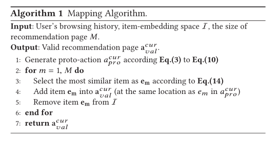
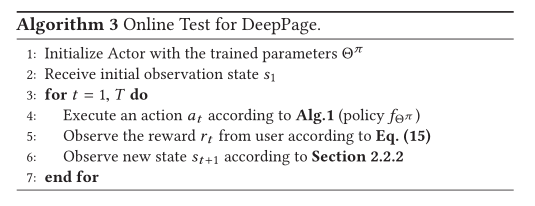
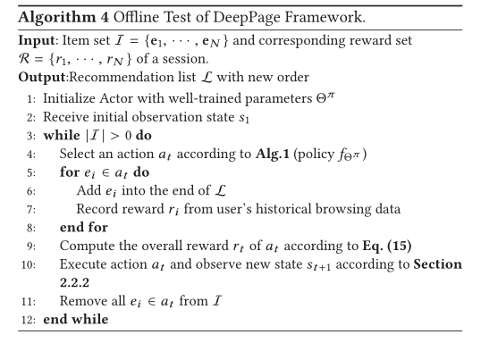
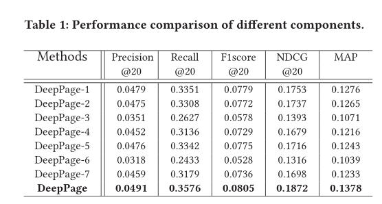

### Deep Reinforcement Learning for Page-wise Recommendations

#### 1.现存问题

现有的推荐系统大多将推荐过程视为一个静态过程，遵循固定的贪婪策略提出建议。然而，这些方法可能无法捕捉到用户偏好的动态本质，而且无法根据用户的实时反馈有效地、持续地更新其推荐策略

#### 2.这篇文章的贡献

（1）引入了一个原则性的方法来生成一组互补的项目，并在一个二维的推荐页面中同时正确地显示它们

（2）提出了一个分页的推荐框架深度，它可以通过吸收用户的实时反馈来共同优化一个项目页面

（3）在一个真实的电子商务数据集中展示了所提出的框架的有效性，并验证了深度推荐的组成部分的有效性。

#### 3.训练和测试程序

（1）联机训练程序

（2）脱机训练程序

（3）框架深度的测试程序。我们设计了两种测试方法，即: 1)在线测试: 在与用户交互的在线环境中测试深度，并接收用户对推荐项目的实时反馈; 2)离线测试:  基于用户的历史浏览数据测试深度。

#### 4.实验

（1）数据：用一家真正的电子商务公司2017年9月的数据

（2）在线测试性能比较

行为者-评判框架适用于具有巨大行动空间的实际推荐系统。在短期的推荐会议中，gru，dqn 和 ddpg 达到了类似的性能。换句话说，gru 模型和像 dqn 和  ddpg 这样的强化学习模型可以推荐符合用户短期兴趣的合适项目。在长时间的推荐过程中，dqn 和 ddpg 的表现明显优于 gru。Gru  的设计是为了最大化推荐的即时回报，而 dqn 和 ddpg  的设计是为了在短期和长期回报之间取得平衡。这一结果表明，引入强化学习可以改善建议的长期表现。最终，深度脱水比传统的 dqn 和 ddpg  有更好的表现。深度可以了解用户的实时偏好和优化页面的项目。

（3）组分效率

省略了类似的在线观察，因为空间的限制。深度 -1和深度  -2验证结合类别/反馈信息和嵌入层可以提高性能。深度-3和深度-6表现较差，这表明在新的推荐会话开始时设置用户的初始偏好，并在当前会话中捕获用户的实时偏好，有助于准确推荐。结合注意机制可以更好地捕捉用户的实时偏好。项目显示策略对用户的决策过程有一定的影响。简而言之，深度优于它的所有变体，这证明了每个组件对于建议的有效性。

#### 5.总结

在这篇文章中提出了一个新颖的页面推荐框架  deepation，它利用深度强化学习自动学习最佳的推荐策略，并同时优化一个页面的项目。基于一家真实的电子商务公司的数据，通过大量实验验证了我们的框架的有效性。进一步的研究方向包括降低从原始行动到有效行动映射的时间复杂性，以及在一个强化学习框架内协同处理多个任务，如搜索、投标、广告和推荐。

