### DRN: A Deep Reinforcement Learning Framework for News Recommendation

#### 大致目录：

（1）简要介绍

（2）相关工作

（3）问题的提出

（4）实验方法

（5）实验结果

（6）结论以及总结

#### 1.目前新闻推荐框架存在的问题

（1）他们只尝试模拟当前的奖励(如点击率)。

（2）很少有研究考虑使用除了点击/不点击标签以外的用户反馈来帮助提高推荐。

（3）这些方法倾向于不断向用户推荐类似的新闻，这可能会导致用户感到无聊。

#### 2.本文提出框架的优势：

（1）与之前的研究不同，该框架应用了DQN结构，可以同时处理当前和未来的回报。虽然我们关注的是新闻推荐问题，但是这个框架也可以推广到许多其他的推荐问题。

（2）考虑了用户活跃度来帮助提高推荐的准确性，这可以提供额外的信息，而不是简单地使用用户点击标签。

（3）采用了一种更有效的勘探方法决斗土匪梯度下降法(dueling  Bandit Gradient descent)，避免了经典勘探方法(如ϵ-greedyandUpper Confidence  Bound)导致的推荐精度下降。

（4）大量的离线和在线实验显示了该框架的优越性能。

#### 3.实验方法相关

（1）模型框架

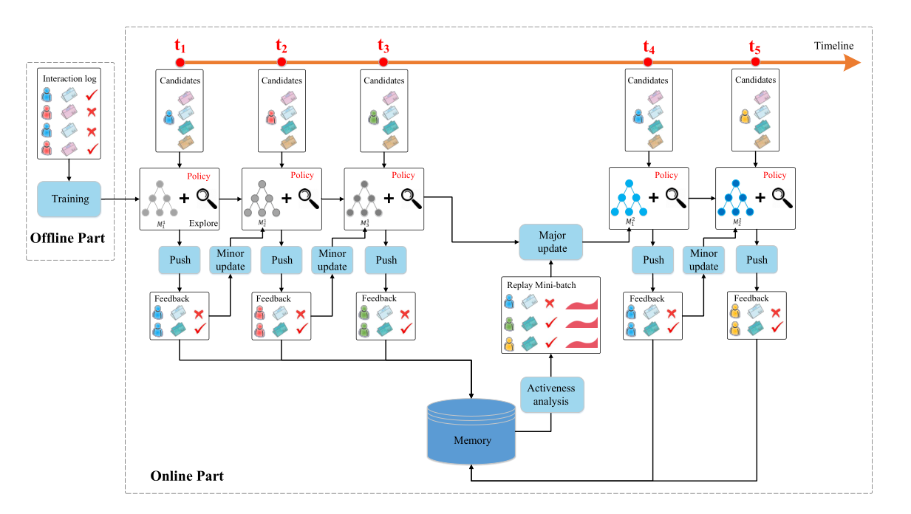

我们的模型由离线部分和在线部分组成。在离线阶段，从新闻和用户中提取四种特征。利用多层深度q  -网络从这四种特征中预测奖励(即用户新闻点击标签和用户活跃度的组合)。该网络使用离线用户新闻点击日志进行培训。然后，在在线学习部分，我们的推荐代理G将与用户交互，并以以下方式更新网络。

1）PUSH、

2）FEEDBACK

3）MINOR UPDATE

4）MAJOR UPDATE

5）Repeat step 1)-4)

（2）功能结构

为了预测用户是否会点击一条特定的新闻，我们构造了四类特征：

1）News features

2）User features

3）User news features

4）Context features

(3)深度强化推荐

我们将这四类特征输入到网络中。用户特性和上下文特性被用作状态特性，而用户新闻特性和上下文特性被用作动作特性。一方面，在某种状态下采取行动的奖励与所有的特征密切相关。另一方面，由用户自身特征决定的奖励(例如，该用户是否活跃，该用户今天是否阅读了足够的新闻)更受用户状态和上下文的影响。基于此观察，我们将q函数分为值函数 V(s)和优势函数A(s,a)，其中V(s)仅由状态特征决定，andA(s,a)同时由状态特征和动作特征决定。

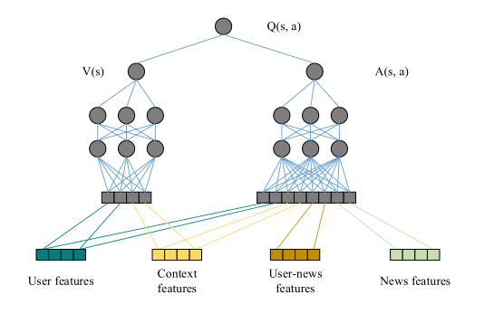

（4）用户主观能动性

使用生存模型来建模用户回复率和用户活跃度。生存分析已被应用于估计用户返回时间领域。假设这是下一个事件(即用户返回)发生之前的时间，那么危险函数(即事件发生的瞬时速率)可以定义为式

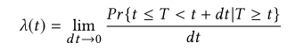

该事件之后发生的概率定义为式

预期寿命span T0可计算为

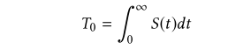

（5）探索

#### 4.具体实验

（1）数据集

在一个商业新闻推荐应用的离线样本数据集上进行实验，并将我们的系统在线部署到该应用上一个月。每个推荐算法都会在收到新闻请求时给出自己的推荐，并记录用户的反馈(点击与否)。

（2）评估措施

计算点击率：

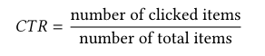

计算k点的精度：

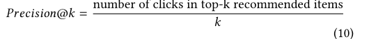

（3）实验设置

在实验中，通过参数空间的网格搜索来确定参数，找出CTR最好的参数

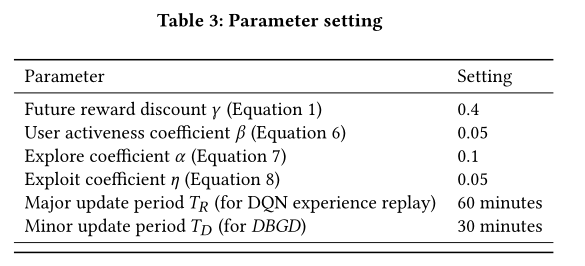

(4)比较方法

1）Variations of our model

2）Baseline algorithms

有：LR、FM、W&D、LinUCB、HLinUCB

（5）离线评估

将方法与离线数据集上的其他基线进行比较。脱机数据集是静态的，并且只记录了某些用户新闻交互对。因此，我们无法观察到不同的推荐决策对用户活跃度的影响。同样，由于候选新闻集有限(即只记录少数候选新闻的点击标签)，探索策略也不能很好地进行探索。因此，考虑用户活跃度和探索的好处在离线设置中不是很明显。因此，我们只展示了在这种情况下推荐准确度的比较。

1）精度

正如预期的那样，我们的算法优于所有的基线算法。与基线相比，我们的基本模型已经取得了非常好的结果。这是因为决斗网络结构可以更好地模拟用户和新闻之间的交互。添加未来奖励考虑(DDQN)，我们实现了另一个显著的改进。那么，结合用户活跃度和探索度并不一定能提高离线设置下的性能，这可能是因为在离线设置下，由于候选新闻静态集有限，算法无法与用户进行最佳交互。

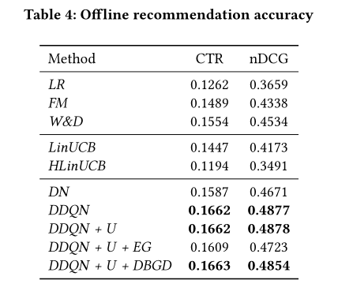

2）模型收敛过程

展示了不同方法的累积CTR，以说明收敛过程。离线数据按时间排序，模拟用户随着时间的推移发送新闻请求的过程。所有比较的方法将每100个请求会话更新它们的模型。正如预期的那样，我们的算法(DDQN  + U + DBGD)比其他方法收敛速度更快，获得了更好的CTR。

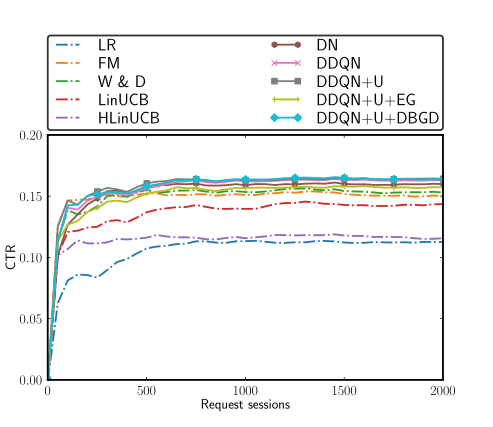

（6）在线评估

1）精确度

我们从CTR,  Precision@5和nDCG三个方面比较了不同的算法。如表5所示，我们的完整模型DDQN + U +  dbgdn在CTR、Precision@5和nDCG方面都明显优于其他所有模型。下面是添加每个组件的观察结果。添加未来奖励(DDQN)确实比basicDN提高了推荐准确度。然而，进一步增加用户活跃度考虑useems在推荐准确度方面并不是很有帮助。

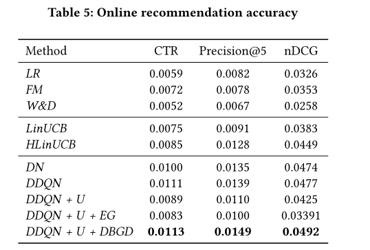

2）推荐的多样性

为了评估探索的有效性，我们利用ILS计算了不同算法的推荐多样性。

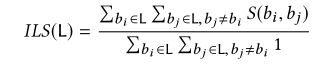

在线实验中用户点击新闻的多样性。更小的ILS更好的多样性。新闻之间的相似度是通过新闻词袋向量之间的余弦相似度来衡量的。

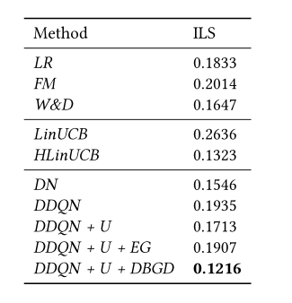

#### 5.实验结论

实验表明，该方法能够显著提高推荐的准确率和推荐多样性。我们的方法可以推广到其他许多推荐问题。