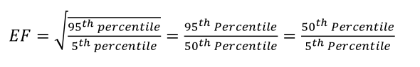
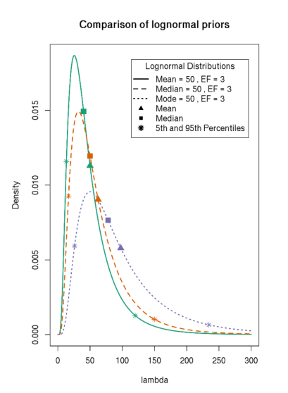
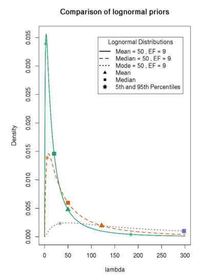
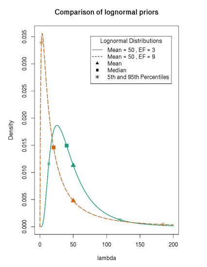
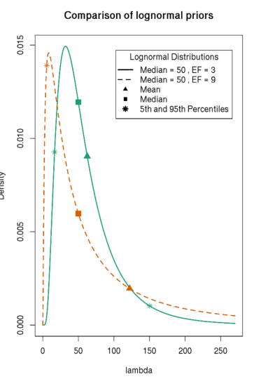
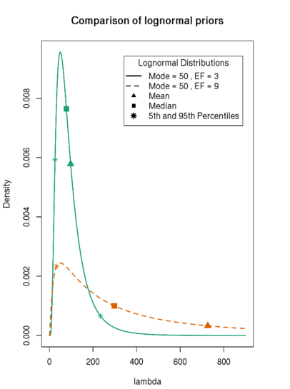
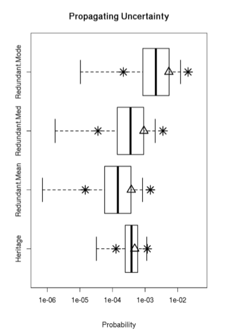
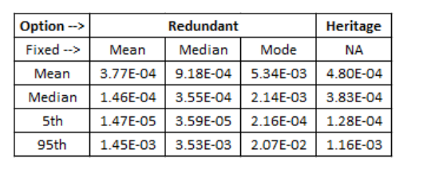
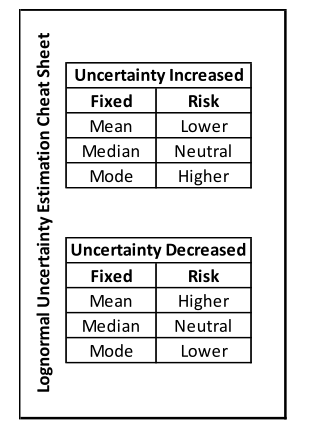

### Uncertainty Estimation Cheat Sheet for Probabilistic Risk Assessment(概率风险评估的不确定性估计备忘单)

不确定性分析的目的是通过量化相关变量中的不确定性，以及通过这些不确定性的传播直到结果，为决策做出技术贡献。不确定性可以被认为是对结果“好”的一种度量，通常用统计离散度来表示。

### 1.概率相关知识的介绍

（1）

概率分布

样本空间

随机变量

概率密度函数

三种连续分布：指数分布、正态分布和对数正态分布

（2）中心性

（3）散布性

（4）失败率不确定性

### 2.贝叶斯方法

贝叶斯方法以先验分布形式对参数可能值的先验置信程度的形式将先验经验纳入估计过程。然后通过贝叶斯定理将具体数据以似然函数的形式进行更新，得到后验不确定度pdf

### 3.不确定估计的基本例子

#### （1）第一个例子

下面的讨论比较了前面提到的启发式方法的几个修改。比较案例假设点估计代表中心位置的一个度量(即平均值、中值或众数)，并且是固定的，而误差因子则是应用或变化的。然后，我们用一个假设的贸易研究来说明，从风险的角度来看，推荐的替代方案取决于固定的中心位置的度量

#### EF:

对数正态分布的一个常用度量是误差因子(EF)。EF定义了中位数的离散度。EF定义为第95个百分位数的平方根除以第5个百分位数。等价地，EF等于50除以5,95除以50，如下等价所述

EF的最小值为1，代表确定性

具体例子：

下图说明了分别使用假设的弥散误差因子3和9度量的启发式方法的三种变体对生成的先前pdf的影响。承包商的可靠性分析报告中给出的是暴露的每百万小时50次故障(FPMH)的故障率(λ)点估计。绿色实线是基本情况假设点的估计值是平均值;橙色虚线曲线假设估计值为中值;紫色虚线假设点估计是模态。生成的每条对数正态pdf曲线上的平方点是中位数(第50个百分位数)，三角形是平均值。

让我们从不同的角度来看待正在发生的事情。第一种情况是将均值固定在50，同时将误差因子在3到9之间变化。在其他情况下，我们保持中值和众数不变，同时改变误差因子。

我们观察到密度曲线的一般形状对保持平均和众数不变相当敏感。因此，我们强烈反对不涉及需要分析人员和主题专家来评估结果密度曲线可视化的步骤的启发式方法。

#### （2）第二个例子

最后一个例子说明了一个假设的贸易研究。它将高度可靠的、传统的、零容错的设计与翻新的冗余选项进行了比较，后者不仅容易受到常见原因故障模式的影响，而且每个冗余部分都被认为比传统设计更不可靠。

下图比较了传统选项的风险和三种量化冗余设计选项风险的不确定性的替代方法,假设所提供的失败率是固定的，表示平均值、中值或众数。

这些结果表明，仅仅选择估计不确定性的中心参数对风险决策的影响实际上是关键的!

### 4.不确定度估计备忘单(对数正态不确定度)

备忘单的目的是加强对参数调整(测量集中趋势和分散)及其风险含义之间的因果关系的理解。小抄本质上是定性的，必须有所保留。最终，选择哪一种集中倾向的衡量标准是主观的。然而，在评估过程中所涉及的假设和信念的背景下，理解和考虑这些选择的风险含义是很重要的。

### 5.结论

对于对数正态不确定性的启发式估计，我们推荐的默认值是量化给定数据的中位数，然后相应地调整误差因子。中值自动保持固定，因为它独立于误差因子。我们的建议即使在不存在数据不确定性且只给出一个中心值的情况下也是成立的。在这种情况下，数据告诉我们平均值、中值和众数重合。因此，在估计中值的不确定性时，我们通过将中值固定到给定的中心值来获得结果。

