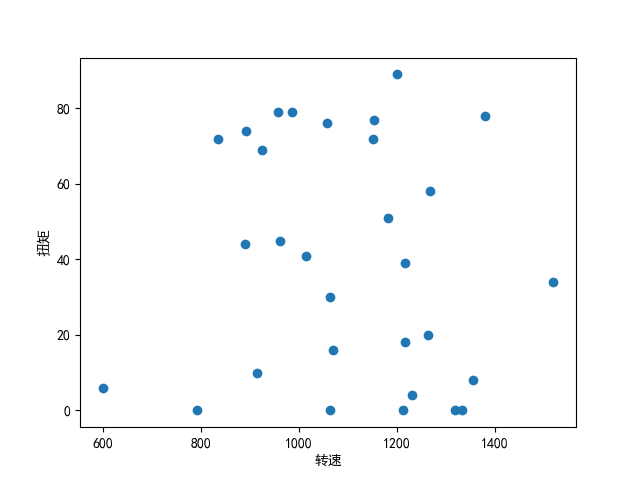
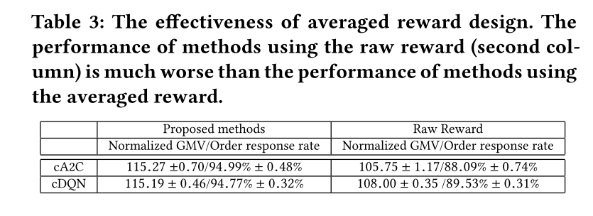

# 张翔宇工作汇报

## 1.毕业设计

## 2.论文绘图

协助师姐绘制不确定性分析图

## 3.论文阅读

#### 《Efficient Large-Scale Fleet Management via Multi-Agent Deep Reinforcement Learning》

### （1）知识点：Q-learning

#### Q-Learning

我们做事情都会有一个自己的行为准则, 比如小时候爸妈常说”不写完作业就不准看电视”. 所以我们在 写作业的这种状态下, 好的行为就是继续写作业, 直到写完它, 我们还可以得到奖励, 不好的行为 就是没写完就跑去看电视了, 被爸妈发现, 后果很严重. 小时候这种事情做多了, 也就变成我们不可磨灭的记忆. 这和我们要提到的 Q learning 有什么关系呢? 原来 Q learning 也是一个决策过程, 和小时候的这种情况差不多. 我们举例说明.

假设现在我们处于写作业的状态而且我们以前并没有尝试过写作业时看电视, 所以现在我们有两种选择 , 1, 继续写作业, 2, 跑去看电视. 因为以前没有被罚过, 所以我选看电视, 然后现在的状态变成了看电视, 我又选了 继续看电视, 接着我还是看电视, 最后爸妈回家, 发现我没写完作业就去看电视了, 狠狠地惩罚了我一次, 我也深刻地记下了这一次经历, 并在我的脑海中将 “没写完作业就看电视” 这种行为更改为负面行为, 我们在看看 Q learning 根据很多这样的经历是如何来决策的吧.

#### Q-Learning 决策

假设我们的行为准则已经学习好了, 现在我们处于状态s1, 我在写作业, 我有两个行为 a1, a2, 分别是看电视和写作业, 根据我的经验, 在这种 s1 状态下, a2 写作业 带来的潜在奖励要比 a1 看电视高, 这里的潜在奖励我们可以用一个有关于 s 和 a 的 Q 表格代替, 在我的记忆Q表格中, Q(s1, a1)=-2 要小于 Q(s1, a2)=1, 所以我们判断要选择 a2 作为下一个行为. 现在我们的状态更新成 s2 , 我们还是有两个同样的选择, 重复上面的过程, 在行为准则Q 表中寻找 Q(s2, a1) Q(s2, a2) 的值, 并比较他们的大小, 选取较大的一个. 接着根据 a2 我们到达 s3 并在此重复上面的决策过程. Q learning 的方法也就是这样决策的. 看完决策, 我看在来研究一下这张行为准则 Q 表是通过什么样的方式更改, 提升的.

#### Q-Learning 更新？？？？

所以我们回到之前的流程, 根据 Q 表的估计, 因为在 s1 中, a2 的值比较大, 通过之前的决策方法, 我们在 s1 采取了 a2, 并到达 s2, 这时我们开始更新用于决策的 Q 表, 接着我们并没有在实际中采取任何行为, 而是再想象自己在 s2 上采取了每种行为, 分别看看两种行为哪一个的 Q 值大, ==比如说 Q(s2, a2) 的值比 Q(s2, a1) 的大, 所以我们把大的 Q(s2, a2) 乘上一个衰减值 gamma (比如是0.9) 并加上到达s2时所获取的奖励 R (这里还没有获取到我们的棒棒糖, 所以奖励为 0), 因为会获取实实在在的奖励 R , 我们将这个作为我现实中 Q(s1, a2) 的值, 但是我们之前是根据 Q 表估计 Q(s1, a2) 的值. 所以有了现实和估计值,== ==我们就能更新Q(s1, a2) , 根据 估计与现实的差距, 将这个差距乘以一个学习效率 alpha 累加上老的 Q(s1, a2) 的值 变成新的值. 但时刻记住, 我们虽然用 maxQ(s2) 估算了一下 s2 状态, 但还没有在 s2 做出任何的行为, s2 的行为决策要等到更新完了以后再重新另外做. 这就是 off-policy 的 Q learning 是如何决策和学习优化决策的过程.==

#### Q-Learning 整体算法？？？

这一张图概括了我们之前所有的内容. 这也是 Q learning 的算法, 每次更新我们都用到了 Q 现实和 Q 估计, 而且 Q learning 的迷人之处就是 在 Q(s1, a2) 现实 中, 也包含了一个 Q(s2) 的最大估计值, 将对下一步的衰减的最大估计和当前所得到的奖励当成这一步的现实, 很奇妙吧. 最后我们来说说这套算法中一些参数的意义. Epsilon greedy 是用在决策上的一种策略, 比如 epsilon = 0.9 时, 就说明有90% 的情况我会按照 Q 表的最优值选择行为, 10% 的时间使用随机选行为. alpha是学习率, 来决定这次的误差有多少是要被学习的, alpha是一个小于1 的数. gamma 是对未来 reward 的衰减值. 我们可以这样想象.

#### Q-Learning 中的 Lambda？？？

我们重写一下 Q(s1) 的公式, 将 Q(s2) 拆开, 因为Q(s2)可以像 Q(s1)一样,是关于Q(s3) 的, 所以可以写成这样, 然后以此类推, 不停地这样写下去, 最后就能写成这样, 可以看出Q(s1) 是有关于之后所有的奖励, 但这些奖励正在衰减, 离 s1 越远的状态衰减越严重. 不好理解? 行, 我们想象 Qlearning 的机器人天生近视眼, gamma = 1 时, 机器人有了一副合适的眼镜, 在 s1 看到的 Q 是未来没有任何衰变的奖励, 也就是机器人能清清楚楚地看到之后所有步的全部价值, 但是当 gamma =0, 近视机器人没了眼镜, 只能摸到眼前的 reward, 同样也就只在乎最近的大奖励, 如果 gamma 从 0 变到 1, 眼镜的度数由浅变深, 对远处的价值看得越清楚, 所以机器人渐渐变得有远见, 不仅仅只看眼前的利益, 也为自己的未来着想.

### （2）Actor-Critic

**今天我们会来说说强化学习中的一种结合体 Actor Critic (演员评判家), 它合并了 以值为基础 (比如 Q learning) 和 以动作概率为基础 (比如 Policy Gradients) 两类强化学习算法**

#### 为什么要有 Actor 和 Critic

我们有了像 Q-learning 这么伟大的算法, 为什么还要瞎折腾出一个 Actor-Critic? 原来 Actor-Critic 的 Actor 的前生是 Policy Gradients , 这能让它毫不费力地在连续动作中选取合适的动作, 而 Q-learning 做这件事会瘫痪. 那为什么不直接用 Policy Gradients 呢? 原来 Actor Critic 中的 Critic 的前生是 Q-learning 或者其他的 以值为基础的学习法 , 能进行单步更新, 而传统的 Policy Gradients 则是回合更新, 这降低了学习效率.

#### Actor 和 Critic

现在我们有两套不同的体系, Actor 和 Critic, 他们都能用不同的神经网络来代替 . 在 Policy Gradients 的影片中提到过, 现实中的奖惩会左右 Actor 的更新情况. Policy Gradients 也是靠着这个来获取适宜的更新. 那么何时会有奖惩这种信息能不能被学习呢? 这看起来不就是 以值为基础的强化学习方法做过的事吗. 那我们就拿一个 Critic 去学习这些奖惩机制, 学习完了以后. 由 Actor 来指手画脚, 由 Critic 来告诉 Actor 你的那些指手画脚哪些指得好, 哪些指得差, Critic 通过学习环境和奖励之间的关系, 能看到现在所处状态的潜在奖励, 所以用它来指点 Actor 便能使 Actor 每一步都在更新, 如果使用单纯的 Policy Gradients, Actor 只能等到回合结束才能开始更新.

#### 增加单步更新属性

但是事物终有它坏的一面, Actor-Critic 涉及到了两个神经网络, 而且每次都是在连续状态中更新参数, 每次参数更新前后都存在相关性, 导致神经网络只能片面的看待问题, 甚至导致神经网络学不到东西. Google DeepMind 为了解决这个问题, 修改了 Actor Critic 的算法。

#### 改进版 Deep Deterministic Policy Gradient (DDPG)

将之前在电动游戏 Atari 上获得成功的 DQN 网络加入进 Actor Critic 系统中, 这种新算法叫做 Deep Deterministic Policy Gradient, 成功的解决的在连续动作预测上的学不到东西问题. 所以之后, 我们再来说说什么是这种高级版本的 Deep Deterministic Policy Gradient 吧.

## 目录：

### 1.简介

### 2.相关工作进行了文献综述

### 3.阐述了问题陈述

### 4.方法

### 5.介绍为培训和评估构建的仿真平台

### 6.定量和定性结果

### 目前存在的问题：

1.尽管有丰富的历史需求和供应数据，但利用这些数据寻求最优配置政策并非易事。一个主要问题是，分配政策的变化将影响未来的需求供应，监督学习方法很难捕捉和建模这些实时变化。

2.另一方面，通过与复杂环境交互来学习策略的强化学习 (RL) [24] 已被自然地用于解决车队管理问题 [10, 11, 28]。然而，传统的强化学习方法很难准确地模拟供需之间的高维和复杂的动态。

### 本文的创新之处：

本文中，我们提出了一种新的 DRL 方法来学习用于车队管理的高效分配策略。 使用 DRL 对车队管理进行建模时存在重大技术挑战：

（1）问题设置的可行性。

（2）大型代理

（3）动作空间的协调和上下文依赖

在本文中，我们提出了一个上下文多智能体 DRL 框架来解决上述挑战。我们的主要贡献如下：

（1）通过对agent、奖励和状态的合理设计，我们提出了一种有效的多agent DRL设置方法来解决大规模车队管理问题

（2）提出了上下文多智能体强化学习框架，在该框架中开发了两个具体算法：contextual multi-agent  actor-critic (cA2C) 和 contextual deep Q-learning (cDQN)。在多智能体DRL中，上下文算法不仅可以在每次数千个学习智能体之间实现高效的显式协调，还可以适应动态变化的动作空间。

（3）为了训练和评估 RL 算法，我们开发了一个模拟器，在使用滴滴出行提供的真实历史数据对模拟器进行校准后，可以完美模拟现实世界的交通活动。

（4）所提出的上下文算法显着优于多智能体 DRL 中最先进的方法，所需的重新定位次数要少得多。

### 模拟器设计（模型）

在本节中，我们介绍了一种模拟器设计，该设计模拟了订单的生成、分配订单的过程和关键驾驶员行为，例如跨城市的分布、现实世界中的在线/离线状态控制。 该模拟器用作 RL 算法的训练环境以及它们的评估。 更重要的是，我们的模拟器允许我们使用从车队管理系统收集的历史数据来校准关键性能指标，因此所学习的策略与现实世界的交通情况非常吻合。

（1）数据说明：滴滴出行提供的数据包括连续四个星期在某城市（成都）中心区域的车辆订单和行驶轨迹。 这座城市被一个由 504 个网格组成的六边形网格世界所覆盖。 订单信息包括订单价格、来源地、目的地和时长。 轨迹每隔几秒包含所有车辆的位置（纬度和经度）和状态（在线、离线、在用）。

（2）Contextual Multi-agent Actor-Critic Algorithm for N agents

### 实验

（1）实验设置

在接下来的实验中，训练和评估都是在第 5 节介绍的模拟器上进行的。对于所有竞争方法，我们规定了两组随机种子，分别控制模拟器的动态进行训练和评估。模拟器中的动力学示例包括订单生成和所有车辆的随机状态更新。在这种情况下，我们可以测试算法在遇到真实场景中看不见的动态时的泛化性能。性能是通过平台在一个情节（模拟器中的 144 个时间步长）中获得的 GMV（模拟器中服务的订单的总值）和订单响应率来衡量的，即平均服务的订单数量除以数量生成的订单。我们使用前 15 集进行训练，并对接下来的 10 集进行所有学习方法的评估。每次在不同地点的可用车辆数量由预调度程序计算。此过程运行虚拟的两阶段订单调度过程，以计算每个位置的剩余可用车辆。平均而言，模拟器每个时间步有 5356 个代理等待管理。本节中介绍的所有学习方法的定量结果都是三次运行的平均值。

（2）性能比较

结果总结在表1中。扩散的结果大大改善了性能，这可能是因为该方法有时会鼓励可用车辆离开具有高密度可用车辆的电网，从而缓解了不平衡的情况。基于规则的方法将车辆重新定位到具有更高需求值的网格，从而提高了随机重新定位的性能。Value-Iter根据所应用的当前策略动态地更新value表，以便它进一步提高基于规则的性能。比较Value-Iter，T-Q学习和T-SARSA的结果，第一种方法始终优于后两种方法，这可能是因为使用集中值表可以进行协调，这有助于避免冲突重新定位。上述方法将状态表示简化为时空值表示，而DRL方法则使用神经网络函数逼近来考虑供需的复杂动态。如表1的最后三行所示，具有深度学习的方法优于上一个方法。最后但并非最不重要的一点是，上下文算法 (cA2C和cDQN) 在很大程度上优于独立DQN (DQN)，这是大型多代理DRL方法和所有其他竞争方法中的最新技术。

表 1：竞争方法在 GMV（GMV：所服务的所有订单的价值） 和订单响应率方面的性能比较。 为了公平比较，控制环境动态的随机种子在所有方法中设置为相同。

（3）重新定位成本的考虑

实际上，每次重新定位都是有代价的。 在本小节中，我们考虑了此类重新定位成本，并通过燃料成本对其进行了估算。 由于从一个电网到另一个电网的行驶距离约为 1.2 公里，燃料成本约为 0.5 元/公里，我们将每次重新定位的成本设置为 c = 0.6。 在这种情况下，代理、状态、动作和转移概率的定义与我们在第 3 节中所述的相同。唯一的区别是，当代理重新定位到不同位置时，重新定位成本包含在奖励中。 因此，一集的 GMV 是所有服务订单价值的总和减去一集的重新定位成本的总和。 例如，DQN 的目标函数现在包括如下的重新定位成本

（4）平均奖励设计的有效性

在多智能体 RL 中，每个智能体的奖励设计对于学习的成功至关重要。在完全合作的多智能体 RL 中，所有智能体的奖励是单一的全局奖励 [5]，但它会遇到每个智能体动作的信用分配问题。将奖励分配给每个代理将缓解这个问题。在本小节中，我们比较了每个代理的奖励的两种不同设计：第 3 节中所述的网格的平均奖励和当时可用车辆数量不平均的网格的总奖励。如表 3 所示，具有平均奖励（cA2C，cDQN）的方法在很大程度上优于使用总奖励的方法，因为这种设计自然会鼓励代理之间的协调。另一方面，使用总奖励可能会将过多的代理重新定位到需求量大的位置

（5）对政策语境嵌入的探讨

上述变化的结果总结在表 4 和图 5 中。从表 4 的前两行和图 5（a）中的红/蓝曲线可以看出，在零重定位成本的设置下，cA2C 实现了最佳性能 与 cA2C-v1 相比，重新定位 (65.37%) 少得多。 此外，在考虑重新定位成本时，协作上下文嵌入具有显着优势，如表 4 和图 5 (b) 的最后两行所示。 它不仅大大提高了性能，而且加快了收敛速度。 由于协作环境在很大程度上缩小了行动空间并在有效性和效率方面产生了更好的政策解决方案，我们可以得出结论，基于协作环境的协调是有效的。 此外，比较 cA2C 和 cA2C-v2 的性能（图 5 (a) 中的红色/绿色曲线），显然策略上下文嵌入（考虑地理和协作上下文）对性能至关重要，这大大减少了冗余策略搜索。

### 总结：

在本文中，我们首先将大规模车队管理问题表述为深度强化学习的可行环境。在这种背景下，我们提出了上下文多agent强化学习框架，其中开发了两种上下文算法cDQN和cA2C，它们都实现了大规模agent在车队管理问题中的协调。cA2C通过利用集中的价值网络和嵌入上下文信息的分散政策执行，既具有灵活性又具有效率。它能够在端到端的训练范式中适应不同的动作空间。使用滴滴出行提供的真实数据开发并校准了模拟器，滴滴出行是我们的培训和评估平台。在模拟器的不同环境下进行了大量的实证研究，证明了该框架的有效性。

