# DRN: A Deep Reinforcement Learning Framework for News Recommendation

### 目录：

#### 摘要

#### 1.简介

#### 2.相关工作

#### 3.问题的定义

#### 4.方法

#### 5.实验结果

#### 6.结论

### 现有推荐模型的弊端：

1.首先，他们只尝试对当前奖励进行建模（例如，点击率）。

2.其次，很少有研究考虑使用用户反馈，而不是点击/不点击标签（例如，用户返回的频率）来帮助改进推荐。

3.第三，这些方法往往会不断向用户推荐类似的新闻，这可能会导致用户感到无聊。

### 创新之处：

（1）我们提出了一个强化学习框架来进行在线个性化新闻推荐。与以前的研究不同，该框架采用了DQN结构，可以兼顾近期和未来的回报。尽管我们专注于新闻推荐，但我们的框架可以推广到许多其他推荐问题。

（2）我们认为用户的积极性有助于提高推荐准确度，这可以提供额外的信息比简单地使用用户点击标签。

（3）采用了一种更有效的探索方法Dueling Bandit Gradient Descent，避免了经典探索方法如ϵ-greedy和Upper Confidence Bound导致的推荐精度下降。

（4）我们的系统已经在线部署在一个商业新闻推荐应用程序中。大量的离线和在线实验表明，我们的方法具有优越的性能。

模型输入：

具体来说，我们使用用户的连续状态特征表示和项目的连续动作特征表示作为多层深度Q网络的输入，以预测潜在的奖励（例如，用户是否会点击这条新闻）。

### 模型：

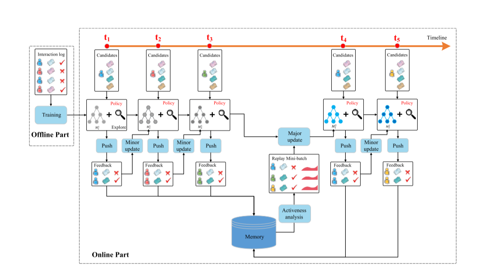

### 实验：

#### 1.数据集

我们对从商业新闻推荐应用程序收集的离线样本数据集进行实验，并将我们的系统在线部署到应用程序一个月。

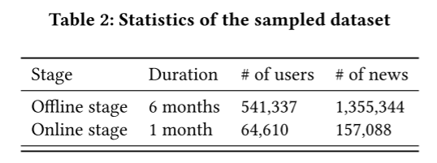

第一个离线阶段，将训练数据和测试数据按时间顺序分开（最后两周作为测试数据），使在线模型能够更好地学习不同会话之间的顺序信息。

在第二个在线部署阶段，我们使用离线数据对模型进行预训练，并在真实生产环境中运行所有比较的方法。

#### 2.评价措施

（1）点击率

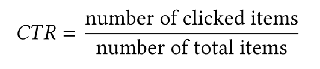

（2）精确度

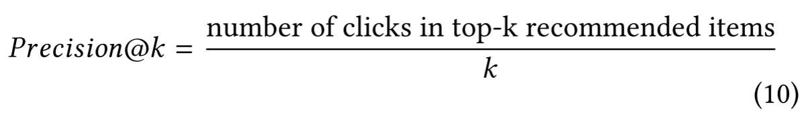

（3）归一化贴现累积收益

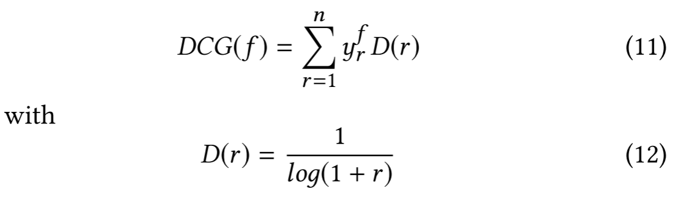

#### 3.参数设置

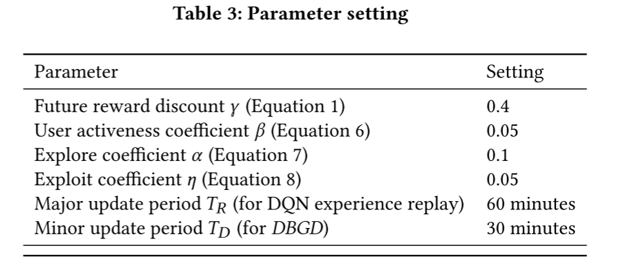

#### 4.Compared methods

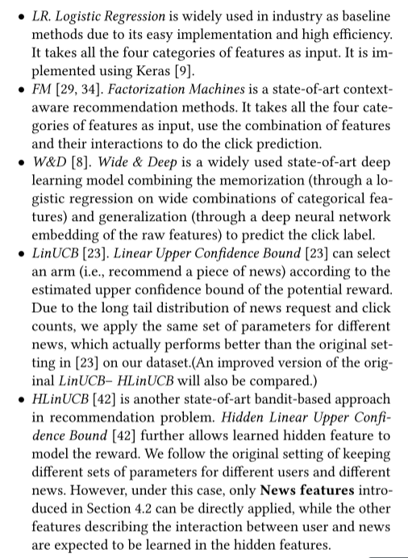

#### our model

我们的基本模型被命名为“DN”，它使用dueling-structure结构Double Deep Q-network 而不考虑未来的奖励。 然后，通过考虑未来的奖励，这成为“DDQN”。 之后，我们向“DDQN”添加更多组件。 “U”代表用户活跃度，“EG”代表 ε-greedy，“DBGD”代表 Dueling Bandit Gradient Descent。

#### 5.离线评估

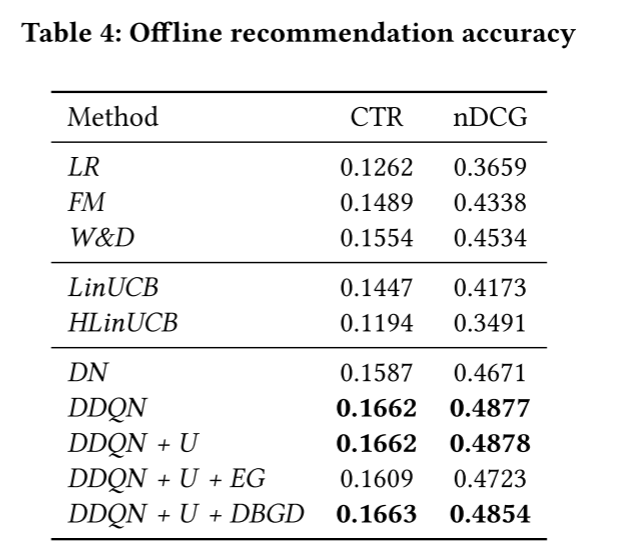

#### 6.在线评估

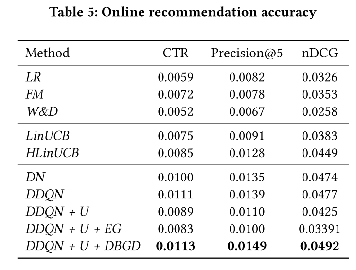

推荐多样性

##### 评价指标：

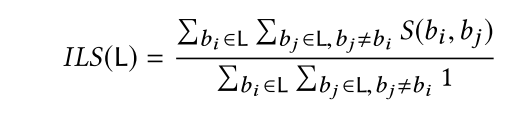

##### 结果:

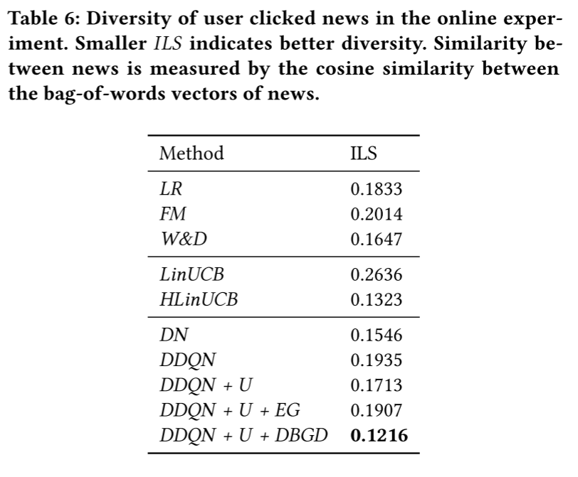

### 结论：

在本文中，我们提出了一个基于DQN的强化学习框架来进行在线个性化新闻推荐。与以往的方法不同，我们的方法可以有效地对动态新闻特征和用户偏好进行建模，并对未来进行明确的规划，以获得更高的长期回报（如点击率）。我们进一步考虑用户返回模式作为点击/未点击标签的补充，以获取更多的用户反馈信息。此外，我们将有效的探索策略应用到我们的框架中，以提高推荐多样性，并寻找潜在的更有价值的推荐。实验表明，该方法能够显著提高推荐的准确性和多样性。我们的方法可以推广到许多其他的推荐问题。

