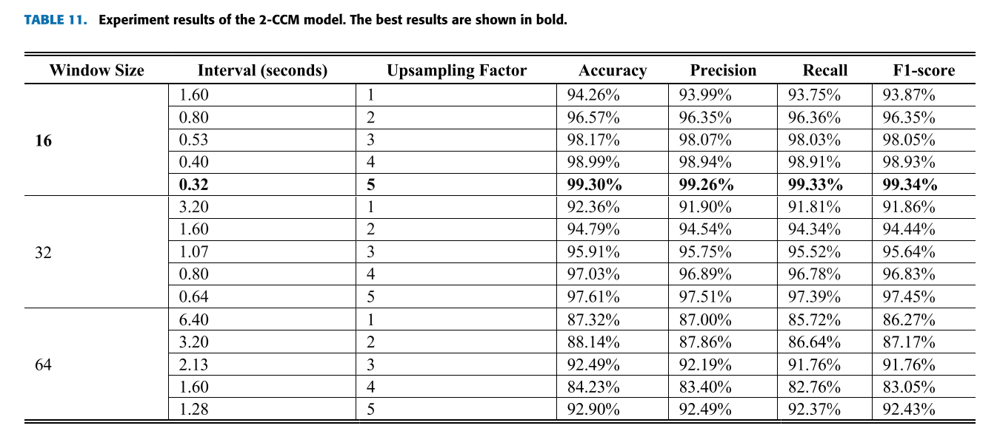

## Driving Behavior Classification Based on   Oversampled Signals of Smartphone Embedded   Sensors Using an Optimized Stacked-LSTM  Neural Networks

### 目录：

#### 摘要

#### 简介

#### 相关工作和科学背景

#### 数据集描述

#### 方法

#### 实验

#### 结论

### 简介：

在驾驶行为分析中，根据所使用的传感器数据，发现了两种方法，即车辆动力学和驾驶员动力学。

车辆动力学主要依赖于传感器的信号，例如全球定位系统 (GPS)、加速度计、陀螺仪和磁力计。相比之下，驾驶员动态主要依赖于主动传感器的信号，例如位于机舱内的摄像机，用于观察驾驶员的行为生物特征。==车辆动力学信号比驾驶员动力学信号更广泛地用于驾驶行为分类，因为车辆动力学有助于提高分类性能。==

==其中一些研究已经通过实验证明，基于长短期记忆（LSTM）循环神经网络（RNN）架构的计算模型最适合驾驶行为分析。==

### 以往研究的缺点：

然而，这些研究中很少有实验评估基于各种时间序列窗口大小和采样率的驾驶行为分类模型的准确性。

### 本文贡献之处：

本研究提出了一种优化的基于 LSTM 的计算模型，用于在两种不同模型中进行驾驶行为分类。 

在第一个模型中，我们使用加速度计，陀螺仪，GPS的信号来区分正常，昏昏欲睡和激进的驾驶行为，以及在DriveSafe应用的数据集中提供的预处理车辆检测数据，该数据使用摄像机传感器。

在第二个模型中，我们使用与第一种方法类似的信号来区分攻击性和非攻击性驾驶行为，而无需预处理车辆检测数据。

使我们提出的技术在驾驶行为分类方面优于最先进技术的关键贡献可以总结为以下几点：

（1）构建两个不同的分类模型以适应两个不同的应用任务。

（2）选择包括原始特征和提取特征的最佳输入特征。

（3）在使用高上采样因子融合传感器数据的过程之后，首次执行过采样会导致非常高精度的模型，尤其是在使用相应的最佳窗口大小的情况下。

（4）优化所提出的 Stacked-LSTM 模型的结构和训练参数。

### 数据收集方法

驾驶行为分析领域的最新研究指出，==使用智能手机传感器==可以获得比车载传感器更好的结果，并且智能手机比车载设备具有更多数量的传感器。

# 相关研究：

### 驾驶行为分类技术

(1)分类特征

(2)分类输出

(3)分类模型

【13】 【24】

但是，[13]，[24] 中的==作者通过实验证明，基于LSTM的计算模型最适合驾驶行为分析==。在 [25] 中还利用了LTSM体系结构来开发驾驶动作预测系统，以提前几秒钟预测驾驶员的动作。与SVM，隐马尔可夫模型 (HMM)，前馈神经网络 (FFNN)，融合-RNN-Exp-Loss (f-rnnel) 模型相比，LSTM模型实现了92.12% 的F1-score，F1-score分别为65.40% 、75.72% 、85.76% 和87.56%。

在 [13] 中，作者将驾驶行为分为三类：正常、昏昏欲睡或攻击性。他们的分类模型提出了一个基于 LTSM 架构的模型，该架构配置了两个隐藏的 LSTM 存储单元层和每层 100 个神经元。使用智能手机嵌入式传感器（例如惯性测量传感器、GPS 和相机）收集数据。该模型将具有 9 个特征的 64 个向量大小的时间序列窗口作为其输入。输入 LSTM 模型的两种类型的特征是车辆特征和道路特征。车辆特征包括沿 x 轴的加速度、沿 y 轴的加速度、沿 z 轴的加速度、侧倾角、俯仰角、偏航角和超速。道路特征包括检测到的车辆数量和与前方车辆的距离。他们使用 UAH-DriveSet [17] 作为自然驾驶数据集来评估他们提出的 LSTM 模型。他们的 LSTM 模型的 F1 分数为 91.0%，而多层感知器 (MLP) 和决策树模型的 F1 分数分别为 48.0% 和 80.0%。

在[24]中，作者将驾驶行为分为四类：高速公路上的攻击性驾驶、二级公路上的攻击性驾驶、高速公路上的正常驾驶或二级公路上的正常驾驶。他们的分类模型提出了一种基于长短时记忆完全卷积网络（LTSM-FCN）结构的模型。这些数据是使用车载传感器或智能手机传感器和前视摄像头收集的。该模型以5分钟的时间序列窗口作为输入，包含12个特征。为LSTM模型提供信息的两种特征是车辆特征和道路特征。车辆特征包括沿x轴的加速度、沿y轴的加速度、沿z轴的加速度、侧倾角、俯仰角、偏航角和速度。

#### 表1显示了通过使用不同计算模型的不同研究所获得的UAH驱动装置数据集驾驶行为分类的F1分数结果。

## 数据集：

UAH-DriveSet [17] 数据集是一个开放数据集，包含超过 500 分钟的自然驾驶会话。该数据集已由阿尔卡拉大学发布，旨在支持驾驶分析。==这些数据是由一个名为 DriveSafe [7] 的驾驶监控应用程序使用智能手机嵌入式传感器（例如惯性测量、GPS 和摄像头）收集的。==

数据集提供了大量的信号； 然而，在我们的研究中，我们只对**原始 GPS 信号、原始惯性测量信号和预处理的车辆检测数据感兴趣。**

## 方法：

### 预处理

（1）同步阶段

UAH-DriveSet [17] 数据集由从智能手机嵌入式传感器收集的信号组成：惯性测量、GPS 和以不同频率（分别为 10 Hz、1 Hz、10 Hz）采样的相机。 因此，应统一不同的采样频率以同步所有使用的数据集信号。 通过将较低采样数据上采样到最高采样频率（即 10 Hz）来执行统一。 因此，我们将具有较低采样频率（即 GPS）的信号上采样到具有最高采样频率的信号（即惯性测量和相机）的频率水平。 为了对收集到的 GPS 信号进行上采样，我们使用了基于线性插值滤波的快速上采样技术。

（2）特征提取阶段

与仅依赖从传感器收集的原始信号的 [13] 不同，==我们在模型中使用的提取特征提高了分类分数==

（3）融合阶段

来自同步或上采样过程的结果信号与其捕获传感器源相关，因此基于传感器信号类型在带有时间戳的单独文件中提供。 因此，实施融合阶段以基于与每个驾驶会话相关的时间戳来获得单个同步序列文件。

（4）过采样级

（5）标准化阶段

在基于深度学习的建模中，归一化不同的特征值是一种更好的做法，以构建一个优越的模型 [13]，[39]。由于我们选择作为输入特征的信号具有不同的比例，因此我们使用标准化技术对这些特征进行了归一化。为了获得每个特征向量内的均值为0，标准差为1的值，我们使用等式 (1 2) 中所示的标准化方法。

（6）分段阶段

滑动窗口技术是大多数驾驶行为分类任务[13]、[18]、[24]使用的基本预处理操作。滑动窗口的基本目标是将信号分割为固定长度，其优点是增加数据集的大小，从而提高计算模型的精度。

### 模型

（1）三级分类模型（3-CCM）

我们的三级分类模型（3-CCM）的目标是根据收集的惯性测量信号（加速度计、陀螺仪）、GPS和预处理的车辆检测数据，区分正常、嗜睡和攻击性驾驶行为。我们的模型是基于LSTM架构的定制设计构建的，该架构由两个称为堆叠LSTM的LSTM单元层组成，并组织为多对一结构，如图3所示。LSTM细胞层均配置有120个隐藏神经元和ReLU激活功能。我们还在两个LSTM单元层中使用L2正则化技术来防止过度拟合。

（2）二进制分类模型 (2-CCM)

对于提出的二元分类模型（2-CCM），我们修改了第 IV-C1 节中描述的 3-CCM 模型，通过排除预处理的车辆检测数据（与前方车辆的距离、检测到的车辆）来自第一个 LSTM 单元层中使用的特征。因此，输入变成一个时间序列窗口，大小为 16 个向量和 11 个特征。在最后一层，我们将驾驶行为分类输出从三个类别更改为两个类别，给出单一分数输出（积极：1 或非积极：0）；我们还将激活函数从 Softmax 更改为 Sigmoid。

### 实验：

### 性能指标：

精确性、召回率、F1分数指标

其中TP是真阳性，FP是假阳性，TN是真阴性，FN是假阴性。

### 初始配置：

为了找到堆叠LSTM模型的所有参数的最佳值，我们使用Keras Tuner库[47]执行了参数网格搜索技术，这导致了超参数值（粗体）的最佳组合，如表7所示，其中显示了所有尝试的参数值。

### 最佳归一化参数

我们的模型在不同归一化情况下的实验结果。 达到最佳结果的平均情况以粗体显示。

### 3-CCM结果

在本节中，我们报告了 3-CCM 模型（在第 IV-C1 节中描述）的结果，用于区分正常、昏昏欲睡和攻击性驾驶行为。基于 ICPT 配置（在第 V-B 节中描述），3-CCM 模型在测试集上实现了 95.26% 的 F1 分数。因此，为了提高 ICPT 的准确性，我们使用不同的时间序列窗口大小（16、32 和 64）进行了几项实验，同时将信号上采样了 1 到 5 倍。在 ICPT 模型优化实验中，该模型被训练为1500 个 epoch 并使用测试集进行评估。根据表 10 中报告的实验结果，我们得出结论，==当时间序列窗口减小（最多 16 个时间步）并且上采样因子增加（最多 5 个）时，模型的准确性得到了提高。==

### 2-CCM结果

### 与最先进结果的比较

StackedLSTM（基于FCPT-3C配置的3-CCM模型和基于FCPT-2C配置的2-CCM）与单一隐藏层LSTM（SL-LSTM）架构之间的比较。

### 结论

该研究使用基于智能手机嵌入式传感器信号（表示为时间序列窗口）的 StakedLSTM 架构，提出了具有两种不同任务（三类分类和二元分类）的驾驶行为分类的卓越模型。三类分类任务区分正常、昏昏欲睡和攻击性驾驶行为，而二元分类任务区分攻击性和非攻击性行为。首先，我们优化了所提出的 Stacked-LSTM 模型的结构和训练参数，达到了 F1 分数（95.26%），比最新报道的最先进的 F1 分数（91%）高出4.26%。接下来，我们利用了额外的特征（加速度、加加速度、航向角和航向角变化），将信号上采样了 5 倍，并配置了更小的窗口大小（16 个时间步长），从而将 F1 分数提高了 4.23 %。

我们的模型超过UAH DriveSet数据集的最新准确度，三级分类和二级分类的F1得分分别为99.49%和99.34%

