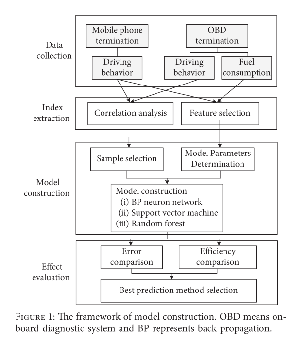
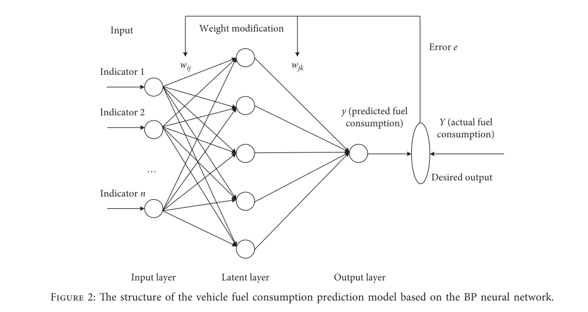
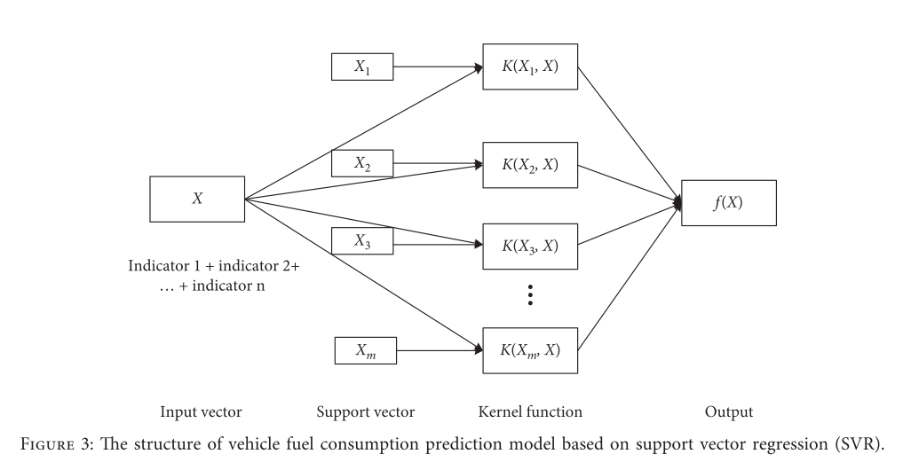
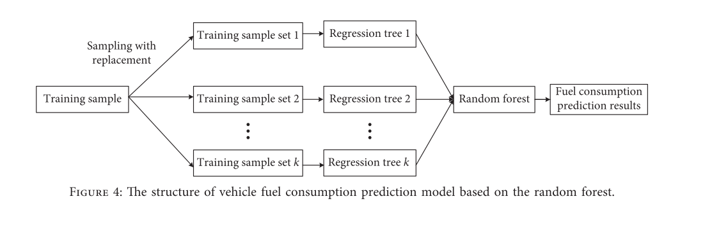
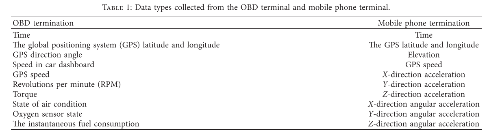
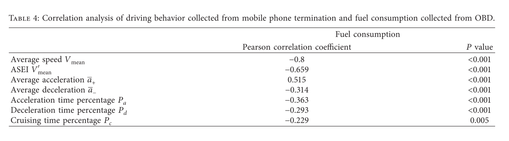
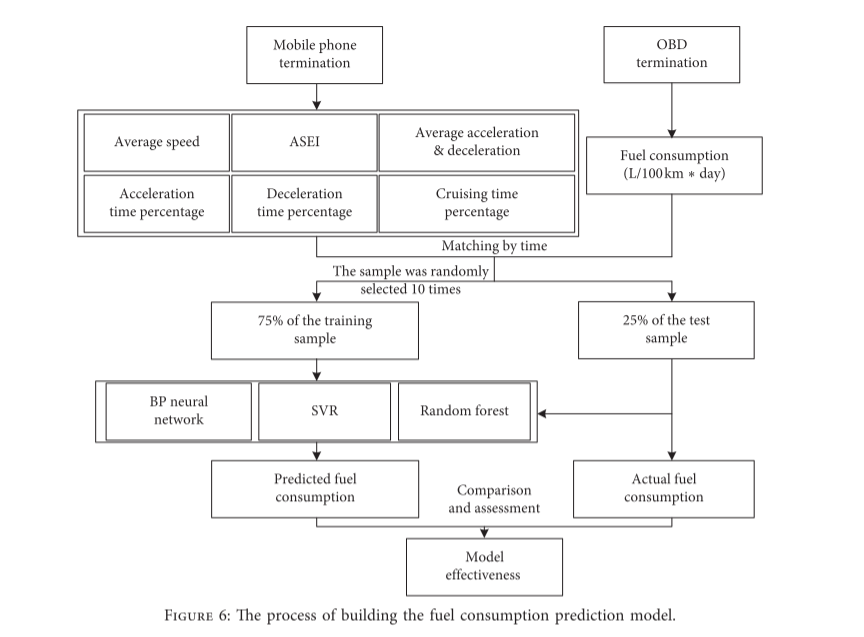
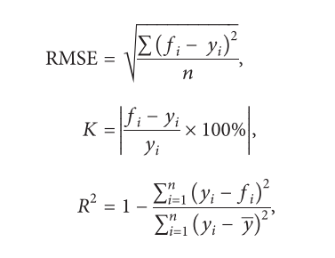
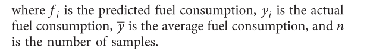
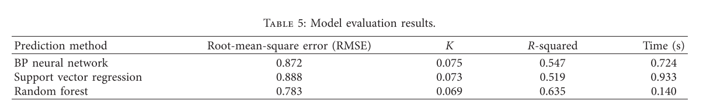

## Vehicle Fuel Consumption Prediction Method Based on Driving Behavior Data Collected from Smartphones

本文的**目的是改进基于手机数据的油耗监测数据库。** 

基于安装在出租车上的手机终端和车载诊断系统（OBD），分别提取驾驶行为数据和油耗数据。 ==通过将手机采集的驾驶行为数据与OBD采集的油耗数据进行匹配，探索驾驶行为与油耗的相关性，从而实现基于手机数据的车辆油耗预测。==

燃料消耗预测模型是使用反向传播 (BP) 神经网络、支持向量回归 (SVR) 和随机森林构建的。

结果表明，平均车速、**除怠速外的平均车速（ASEI）**、平均加速度、平均减速度、加速时间百分比、减速时间百分比、巡航时间百分比是油耗评价的重要指标。

三种模型都能准确预测油耗，绝对相对误差小于10%。 随机森林模型被证明具有最高的准确性和运行速度更快，使其适用于广泛的应用。 该方法为城市交通油耗监测数据库的完善和精细化管理奠定了基础。

## 方法：

模型构建框架:

油耗预测步骤如下:

(1)数据采集：基于GPS、直线加速度计、陀螺仪等手机传感器采集多位驾驶员自然驾驶行为数据。同时，车载OBD终端同时采集实时车辆油耗数据。

(2)指标提取：将手机和OBD终端的数据按时间进行组合。 通过比较两种终端驾驶行为数据的一致性和差异性，提取出基于手机数据预测车辆油耗的指标。

(3)模型构建：随机选择训练集和测试集，使用反向传播（BP）神经网络、支持向量机和随机森林构建油耗预测模型。

(4)效果评价：通过多次构建油耗预测模型，比较三种预测模型在不同方法下的准确率和效率，提出了基于移动端的汽车油耗预测最佳方法。

### 预测模型有：

#### （1）BP神经网络

#### （2）支持向量回归

#### （3）随机森林

### 实验数据源

==实验数据来自安装在出租车和手机终端上的车载诊断终端，采样间隔为1s。==

收集的数据类型：（从OBD和手机终端中收集了哪些数据）

### 指标提取

### 皮尔逊	

Pearson相关是一种常见的基于滤波器的==特征选择==方法。通过分析手机采集的驾驶行为数据与OBD采集的油耗数据之间的Pearson相关性，==通过滤波可以选择车辆油耗等关键驾驶行为指标。结果如表4所示。所有驾驶行为指标均与油耗显著相关 (P&lt; 0.05)。因此，选择平均速度、ASEI、平均加速度、平均减速度、加速时间百分比、减速时间百分比、巡航时间百分比等指标来预测油耗。==

## 实验：

### 模型训练：

基于出租车司机日常驾驶行为数据构建油耗预测模型的流程如图6所示。一方面，平均车速、ASEI、平均加减速、加速时间百分比、减速时间百分比等指标，利用手机端采集的驾驶行为数据，计算出每位驾驶员每天的巡航时间百分比。另一方面，通过OBD终端采集车辆的瞬时油耗数据，转化为日油耗数据。通过采集时间匹配两个数据源（驾驶行为数据和每日油耗数据）。在收集的所有数据中，随机选择 75% 作为训练样本，其余数据为测试样本。基于BP神经网络、SVR和随机森林构建油耗预测模型。为保证预测模型的准确性和稳定性，共进行了10次样本选择和模型训练。==通过比较三款车型预测油耗与实际油耗的差异，评价使用手机数据预测汽车油耗的准确性。==

### 为了评价三种==油耗预测模型的准确性和效率==，比较了均方根误差（RMSE）、平均绝对百分比误差K、R平方和模型运行时间四个指标。 这三个指标的计算方法如下：

==得出：==

通过比较三种模型的误差和效率可以看出，基于随机森林的模型比BP神经网络或SVR具有更高的准确率，并且随机森林模型的运行时间远低于BP 神经网络和 SVR 模型。 因此，基于随机森林的油耗预测模型对于基于手机收集的个体驾驶行为的预测是有效的，更适合于更大样本数据集的实际应用。

### 结论：

#### 在这项研究中，分别从OBD和手机终端收集的出租车司机的驾驶行为数据和油耗数据进行了匹配。分析了驾驶行为与油耗之间的相关性，并通过基于滤波的特征选择方法提取了影响油耗的相关驾驶行为指标。利用选定的7个驾驶行为指标 (即平均速度、ASEI、平均加速度、平均减速度、加速时间百分比、减速时间百分比和巡航时间百分比)，构建了基于BP神经网络、SVR和随机森林的3个油耗预测模型。

模型误差和运行时间对比分析结果表明，三种模型均能准确预测油耗，其中随机森林模型的预测精度和效率最高，RMSE为0.783 L/100 km，平均绝对百分比误差（K）为6。9%，模型运行时间为0.14秒。这一发现与Wickramanayake和Bandara[15]的研究一致，这也表明随机森林模型在基于驾驶行为数据预测燃油消耗方面最有效。Wickramanayake和Bandara的研究对象是公交车的油耗预测，本研究主要针对出租车的油耗。同时，本研究的驾驶行为数据是从灵活性和复杂性更高的手机中收集的，而不是从固定的GPS设备中收集的。

