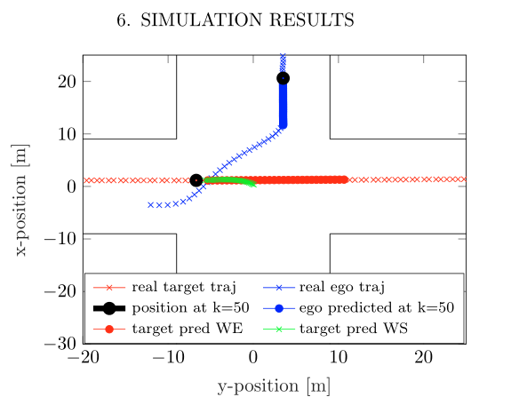

# Modelling Human Driving Behavior for Constrained Model Predictive Control in Mixed Traffic at Intersections

## 目录：

摘要

简介

在第二节中，我们描述了人类驾驶行为是如何从真实数据中建模的

第三节概述了如何在线确定人类驾驶员的实际模式

自我车辆的路径生成将在第4节中介绍。

在第5节，概述了具有多模式约束的人类驾驶员模型预测控制方案

一些概念证明的仿真结果显示在第六节

最后在第7节中得出一些简短的结论。

在包括人类司机和自动驾驶汽车在内的混合交通路口，安全的自动通行是一项挑战。我们提出了一种定制的方法，尽管融合了学习模型和模型预测控制的不确定性，但提供了保证。在没有全局控制器假设的情况下，该预测控制器通过加速度和转向角对单个自动驾驶车辆进行控制。==人类行为的每个机动都用神经网络建模，神经网络作为一个约束进入预测控制器的公式。==**作为一个例子，我们考虑一辆单独的自动驾驶汽车在一个没有信号的十字路口，这给了一个人驾驶的车辆通行权。我们展示了人类驾驶行为可以基于真实记录的轨迹数据建模，并通过动态改变优化问题的约束来实现所提出的预测控制方法。**

在这样的环境中做决定需要足够的预测模型来预测人类的驾驶行为。虽然存在通过第一原理模型近似建模

人类驾驶员的方法，(Falcone等人，2008;Borrelli  et al.， 2005)，机器学习方法的使用是最有前途的

### 本文提出了一种基于模型预测控制(MPC)的自动驾驶汽车控制方法。MPC计算最优控制行为，同时考虑其他车辆的行为作为动态约束。这些车辆的行为是用神经网络建模的。

### 数据集：我们使用了澳大利亚现场机器人中心 (Bender等人，2015) 提供的数据集。

### 提出的模型预测控制器和学习方法的融合，具有以下优点:

(1)人类的驾驶行为可以从真实数据中建模。

(2)神经网络预测的人的驾驶行为可以直接作为控制器中的约束条件。

(3)所有可能的模态都可以被认为是约束，而不仅仅是最可能的约束。

(4)模态的概率可以在线计算(在每一个时间步)。

(5)多模态控制模型可以从最优控制问题的约束条件中在线去除不太可能存在的模态，从而降低了系统的保守性。

### ==基于模型，所提出的控制器预测人类驾驶车辆的轨迹，即未来状态。==

### ==在这里，神经网络被用作预测模型。通过观察数据的回归，预测人类车辆状态。==

唯一的控制输入是自我车辆的转向角度和加速度。假设没有进一步的通信(V2X)或交通灯优化。红绿灯和其他车辆都不受控制。

该数据集(Bender  et  al.(2015))包括在无信号交叉口的人类驾驶车辆的测量数据。每个数据条目都包含车辆的纬度、经度和方向，以及进行观测的时间戳。我们考虑了6种不同的模式。每个模态m由两个字母表示，第一个字母表示目标车辆的初始基本方向，第二个字母表示目标车辆的最终基本方向。

我们考虑一辆自动驾驶汽车在一个4路无信号交叉口，可能需要给一个人驾驶的目标车辆让路。

此外，需要确保所有可能模式的安全距离。因此，当某一模式变得不太可能时，自我车的约束约束更少，能够加速安全快速地通过交叉口。