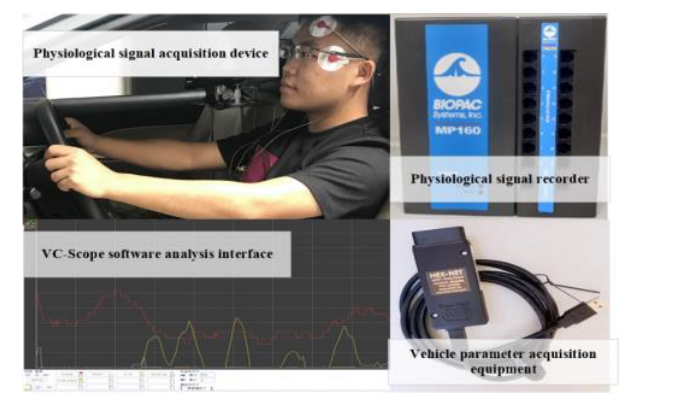
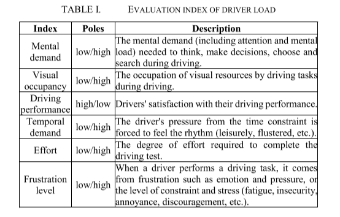
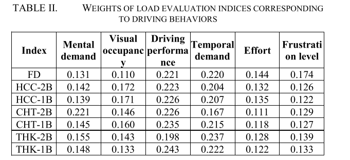
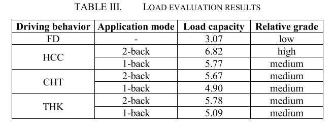
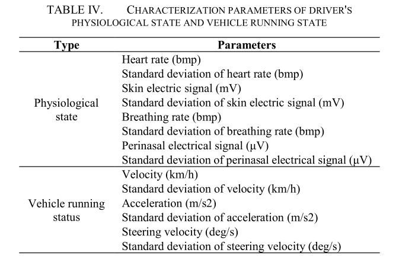
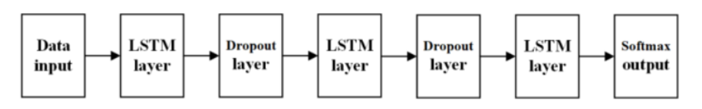

# A risky prediction model of driving behaviors: especially for cognitive distracted driving behaviors

### 实验条件：

#### 测试场地：

实车测试场地为国家封闭测试园区。场地所有道路建设均符合中国国家标准。站点的俯视图如图1所示，地图中不必要的部分已被隐藏。试验场地路面为水泥混凝土，无坑洼，痕迹清晰。主要试验路段1～4为两条车道，设计最高时速70km/h，道路宽度6m，选定试验路段总长约3.6km。

#### 传感器：

HEX-NET硬件和VC-scope分析软件相结合，通过测试车辆的OBD诊断接口采集车辆运行参数。 BIOPAC 的 MP160 生理信号记录仪和 Acqknowledge 4.2 软件用于通过皮肤接触收集驾驶员的生理信号。

驾驶行为分类：

（1）Focused driving (FD)

（2）Handheld cellphone calls (HCC).

（3）Thinking (THK).

（4）Chatting (CHT).

n-back测试

为了定量地应用分心驾驶行为的负荷，使用n-back范式作为驾驶负荷应用方法。在一组n-back测试中，受试者将依次听到1 0随机设置的1位数数字 (0-9)。每个数字之间的暂停间隔为2秒。受试者在听到某个数字后，需要在数字之前重复第n位。

在完成单次驾驶测试后，使用上述驾驶负荷评估方法对每个受试者进行调查。 计算各驾驶任务对应负荷评价指标的权重，将各评价指标组合配对，采用一一比较法。 ==受试者从各组中选取对负荷贡献较大的评价指标，根据各组选取的次数确定该指标对驾驶负荷的权重，归一化后得到表Ⅱ==。 

==单项驾驶任务的整体驾驶负荷评价值为六项评价指标的加权平均值乘以10，评价结果见表三。==

### 驾驶过程中的负担：

以表三中的负荷评价等级为对比标准，综合参照基于行为标准的表征参数对比结果，得到认知型驾驶行为表征参数的交叉对比结果，作为 下一节中预测模型的训练样本。

#### 驾驶员生理状态和车辆运行状态的表征参数

**以表三中的==负荷评价等级为比较准则==，综合参考基于行为准则的表征参数比较结果，得到认知型驾驶行为表征参数的交叉比较结果:作为下一节预测模型的训练样本。**

根据基于负载判据的生理参数和车辆运行状态参数的分布，有9个特征参数表现出显着差异：心率、呼吸频率、鼻周电信号、速度、标准差速度、加速度、转向速度和转向速度的标准偏差。==通过交叉比较，得到训练LSTM模型的参数如下：心率、呼吸频率、鼻周电信号、速度、速度标准差、加速度、转向速度标准差。==

### 实验：

#### 基于LSTM的认知分心驾驶行为预测网络

==以7个驾驶特征参数为输入，4个认知分心驾驶行为为输出==，

设计了基于LSTM的认知分心驾驶行为预测网络。具体网络结构如图9所示。基于LSTM的认知分心驾驶行为预测网络结构主要由三层LSTM组成，用于提取抽象特征。==同时，为了避免过拟合，我们在三个LSTM层的中间嵌入了两个dropout层。==RNN网络可以提高噪声，我们把它放在细胞之间，也就是在时间步长连接中，而不是让dropout层作用于单个神经元。

#### 实验数据准备和实验环境：

(1)实验共收集81组数据。

(2)数据清理

每组数据包含4种认知分心驾驶行为的7个驾驶参数。对设备采集错误的数据进行了清理。清洗后，

(3)56组数据进行模型训练，25组数据进行模型试验。每组数据包含418个时间步长。

### 实验环境：

实验在实验室工作站上进行，CPU为i7-7700k,  GPU为NVIDIA GTX 1080ti，内存为16g。选用Python作为编程语言，Tensorflow作为深度学习框架。

#### 结果：

在模型的训练中使用Adam作为优化器，LSTM的每一层隐藏节点数设置为128个。通过实验，经过89600次迭代后，训练集的准确率逐渐稳定。==经过100000次迭代，训练集的正确率为90.2%，测试集的正确率为74%。==为了验证网络预测的实时性，将4个认知驾驶任务的7个驾驶表征参数实时同步到网络中，实验验证平台下的平均预测时间为80ms。

### 全文结论：

与以往的研究相比，本文有3个贡献:

(1)改进了NASA-TLX量表，用于评估驾驶员的负荷，并根据定量负荷对不同认知二级任务进行排序。

(2)提出行为准则和负荷准则作为参考标准，探讨典型认知分心驾驶行为对驾驶员生理状态和车辆运行状态的影响机制。

(3)在自然数据的检验下，分心驾驶行为预测模型取得了较好的结果，比模拟驾驶更有意义。因此，本文的方法和结果可以有效地提供参考，但不限于认知和视觉驾驶行为的估计，驾驶负荷分析等。