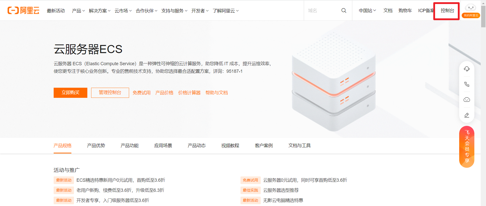
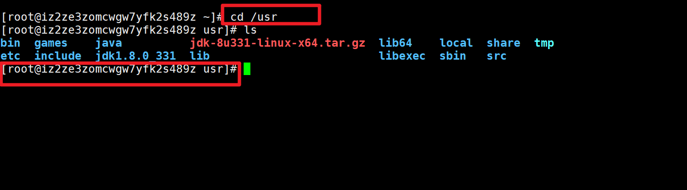
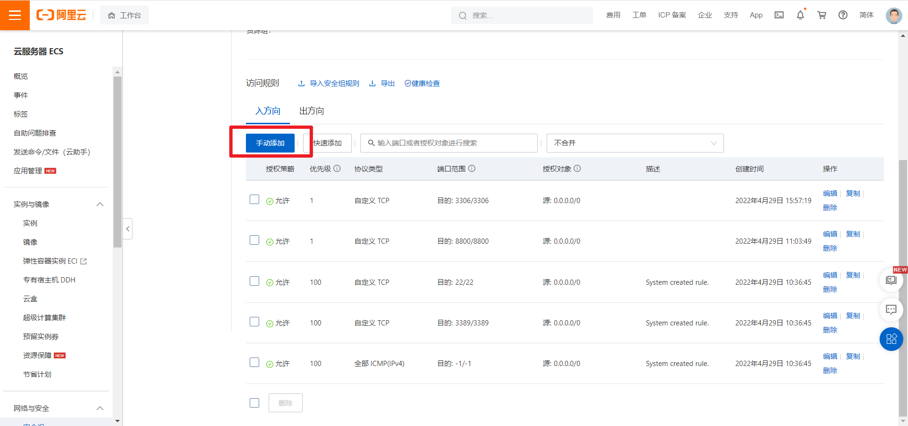

# 保姆级教程——将springboot项目部署到阿里云服务器（小白包会）

## 前言：

昨天本想着看论文，结果发现找的论文和课题不一致。那干点什么好呢？那就把我的毕业设计（一个springboot项目）部署到服务器上，随便试试喽。网上的教程发现大部分都是一知半解，只能东拼西凑的查，费了不少时间。希望这篇博文能帮助一下刚入手的像我一样的小白！

纯小白一枚，那就一步一步捋一捋自己部署过程。

## 步骤一：拿到一台阿里云的服务器

#### 1.到达阿里云官网


#### 2.有账号的可以直接登录，没有账号的自己注册一个


#### 3.找到搜索框


#### 搜索“云服务器”


#### 4.可以购买一台，AND新用户可以试用，也可以进行学生认证进行免费试用（我这里选择的是：新用户试用）


#### 5.选择自己需要的配置（这里是我的选择，你可以自由选择适合自己的）


#### 6.回到控制台，找到自己申请或者购买的服务器




#### 7.设置安全组


#### 8.回到控制台，找到云服务ECS


### 显示如上图，表示成功！到此，阿里云服务器搞定！！！

## 步骤二：下载并安装Xshell，使用Xshell连接阿里云服务器

#### 1.安装Xshell


#### 邮箱验证后，即可下载安装包。

#### 之后下载，大家肯定都会，选择安装路径，一路下一步就OK！

#### 2.使用Xshell连接阿里云服务器


#### 连接成功，到此，我们可以通过Xshell来对阿里云服务器进行相应的配置和操作。

## 步骤三：阿里云服务器上安装JDK

#### 1.到官网去下载jdk的Linux版本，官网地址：https://www.oracle.com/technetwork/java/javase/downloads/jdk8-downloads-2133151.html，我使用的是jdk-8u331-linux-x64.tar.gz

#### 2.在本地显示的是


#### 3.将这个文件上传到阿里云服务器

#### （1）我们要在云服务器上安装这个命令,在Xshell中执行

```txt
yum install lrzsz
```


#### (2)找一个放置jdk压缩包的位置，我这里是在/usr下



#### （3）执行

```txt
rz -be
```

### 不加be参数的话，会报中文乱码错误，这里要注意！！！


#### （4）查看/usr下的压缩包，确认传输成功


#### （5）接下来解压安装包就算安装成功了，使用tar命令解压压缩包

```txt
tar -zxvf jdk-8u331-linux-x64.tar.gz
```


#### (6)配置系统环境变量

#### 先cd进目录 /etc ，再使用 vim命令编辑文件profile


#### 在profile文件中，按键盘i键，进入编辑模式，在文件末尾加上以下几行(请注意JAVA_HOME文件路径)

## ==这一步要注意注意再注意！！！==

```txt
export JAVA_HOME=/usr/jdk1.8.0_331
export CLASSPATH=$JAVA_HOME/lib/
export PATH=$PATH:$JAVA_HOME/bin
export PATHJAVA_HOME CLASSPATH
```


#### 编辑完之后，按Esc键退出编辑模式，然后按：  之后输入wq，再回车退出（Linux中vim的基础，不了解的小伙伴可以了解一下Linux中的vim）

#### (7)立即执行profile文件，使之生效，使用source命令（source命令：依次执行文件所有语句）


#### (8)到这一步，jdk的安装就全部完成了。最后，我们再使用java命令验证一下，如果可以看到我们的版本信息就可以了。


#### 如果没有正常显示，请注意检查JAVA_HOME的路径是否正确！！！

## 步骤四：阿里云服务器上安装mysql5.7

#### 1.先创建一个存放mysql的文件夹

```txt
//创建一个名字为mysql的文件夹
[root@localhost /]# mkdir /mysql
//进入mysql这个文件夹
[root@localhost /]# cd /mysql
```

#### 2.使用以下命令进行下载yum源（这里是mysql5.7的命令）

```txt
[root@localhost mysql]#  wget 'https://dev.mysql.com/get/mysql57-community-release-el7-11.noarch.rpm'
```

#### 下图表示下载完成


#### 3.使用以下命令进行安装yum源

```txt
[root@localhost mysql]# rpm -Uvh mysql57-community-release-el7-11.noarch.rpm
```


#### 4.使用以下命令查看拥有的mysql

```
[root@localhost mysql]# yum repolist all | grep mysql
```


#### 5.使用以下命令安装mysql

```txt
[root@localhost mysql]# yum install -y mysql-community-server
```

#### 安装成功显示如下！


#### 6.启动mysql

```txt
[root@localhost mysql]# systemctl start mysqld
[root@localhost mysql]# systemctl status mysqld
```


#### 7.使用系统自动生成的密码，记下来，登录数据库，并进行修改密码

#### mysql5.7的新特性之一就是在初始化的时候会生成一个自定义的密码，然后你需要找到这个密码，登录的时候输入。**注意，输入密码的时候是不显示**。

```txt
[root@localhost mysql]# grep 'temporary password' /var/log/mysqld.log 
```

#### 这里红色框圈的就是临时密码 复制下来 等下修改密码使用


#### 登录数据库

```txt
[root@localhost mysql]# mysql -u root -p
```

#### 这里红线的位置是输入你的临时密码，成功之后就如下图所示：


#### 使用以下命令，修改密码

```txt
UPDATE mysql.user SET authentication_string=PASSWORD('your_new_password') WHERE User='root';
```

#### 如下图，表示修改成功


#### 8.开启远程登录，授权root远程登录，通俗的讲就是：让阿里云服务器上的mysql打开权限，好让咋们window上Navicat能连接的上

```
# 打开权限
mysql> UPDATE mysql.user SET host = '%' WHERE user='root';
# 进行刷新
mysql> FLUSH PRIVILEGES;
```

#### 9.到阿里云官网，配置阿里云服务器的安全组




#### 10.在window上，用Navicat连接云服务器上的mysql数据库


## 步骤五：部署SpringBoot项目

#### 1.linux云服务器上的环境我们都已经配置好了，但好像差了一个tomcat？因为springboot内置了tomcat，所以后面我们把它打包成jar包就可以免去tomcat的配置了（如果是打包成war包，那还是要配置tomcat的）。

#### 2.回到我们本地windows Springboot项目，下面我们对我们的项目做一些设置,到IDEA中，打开pom.xml，添加如下语句，将项目的打包形式设置好

```txt
<!-- 打包成jar包 -->
<packaging>jar</packaging>
```


#### 3.打开application.properties,设置项目运行端口（我用的是8800，默认是8080，如果你用的是别的端口，要把你的端口加入到安全组中去）


#### 4.打开application.yml，设置端口，连接数据库


#### 5.在idea中进行打包

#### 点击右侧的maven


#### 双击package，进行打包


#### 显示如下图，表示打包成功


#### 6.找到打包好的jar包，在项目的target文件夹下


#### 7.在Xshell中使用rz命令，将jar包上传至阿里云服务器

#### 这里rz命令不能加参数


#### 8.使用命令ls,查看，如下图，有jar包存在，表明上传成功


#### 9.使用java指令运行项目jar包，进行项目部署

```txt
java -jar ***.jar  //***为你的jar包名
```


#### 10.随便找个浏览器，搜索栏输入http://公网ip:端口号 就可以搜索到你的网站了（服务器带宽速度比较小的话，第一次载入会非常慢，耐心等等）

#### 11.还没完呢，这种启动方式是一次启动，当我们关掉Xshell的时候，我们的网站又访问不上了，又得重新打开Xshell，执行 java -jar ***.jar。所以我们要使用下面的方法让这个项目在服务器上自动不间断地跑.

```txt
nohup java -jar  ***.jar  &     //***为你的jar包名
```

#### 12.把Xshell关掉，在浏览器上输入http://公网IP:8800 发现项目还是可以进入，说明我们已经设置成功了。至此springboot项目部署到阿里云服务器上完结。

#### 13.我们通常访问网站，都是在浏览器中输入www.xxxx.com这种，这是因为人家用了域名，域名可以到阿里云官网进行购买

#### 14.购买域名


#### 搜索你想要的域名，进行查询


#### 挑选之后，进行购买


#### 购买之后，回到控制台


#### 进行解析


#### 15.解析之后，得审核几天，然后备案什么的，才能使用www.域名.com:8800 的方式访问我们的网站了。


## 因为我是已经部署好之后，捋的“回忆版”，很多步骤没有操作，上面很多图片来自下面的博文。有不足的地方，欢迎大家指正！

## 参考博文如下，写的都非常棒！！！

https://blog.csdn.net/allen_csdns/article/details/104554928?spm=1001.2014.3001.5506

https://blog.csdn.net/Assist1/article/details/103891315?spm=1001.2014.3001.5506

https://blog.csdn.net/qq_45441466/article/details/109670194?spm=1001.2014.3001.5506