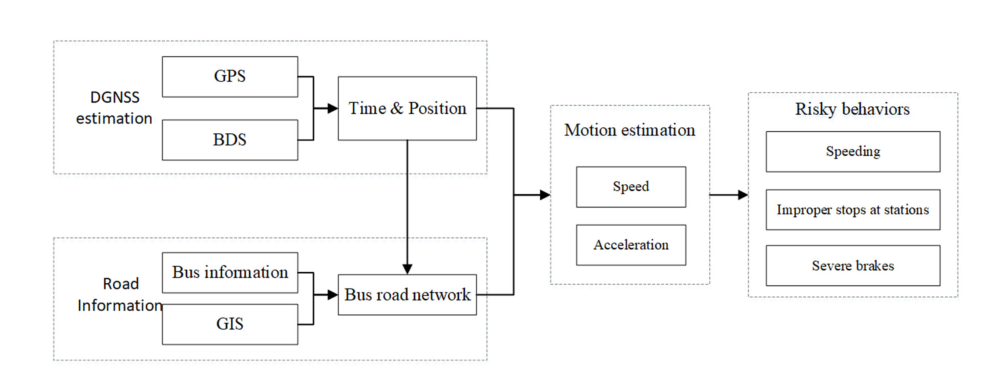
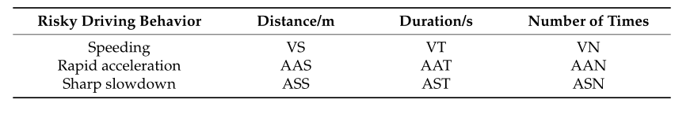

# 基于实时GNSS轨迹和道路信息的城市公交车驾驶行为分析

## 摘要：

公交车司机的驾驶行为关系到全体乘客的安全和城市交通的规范。为了分析速度和加速度的相关特征，准确的公交车轨迹和模式对于驾驶员行为分析和有效智能公共交通的开发至关重要。==利用实时车辆跟踪技术，本文利用差分全球导航卫星系统（DGNSS）模块开发了一个车载终端平台，用于驾驶员行为分析。DGNSS轨迹用于推导车辆轨迹，然后将其与道路信息联系起来，生成速度和加速度矩阵。在城市环境中的多条公交线路上进行了全面的现场测试。时空分析结果表明，该平台能够自动、准确地提取驾驶行为特征。==此外，该平台的视觉功能可用于有效监控多条公交线路的超速和剧烈加速等驾驶风险。为智能交通系统（ITS）设计和应用提供了平台功能的详细信息。

公共汽车的驾驶特性和行为对保证安全可靠的出行至关重要。可以使用各种元素来评价公交车的驾驶行为，即超速、延迟时间、不当停车。我们调查了在公交车站对超速、严重制动和停车质量的评估，如下面的流程图所示，描述了司机行为的分析。

==超速：==研究在数据库中设置当地道路交通的限速信息，通过过滤后的DGNSS定位数据估计公交车速度。因此，公交车的速度可以判断公交车是否超速。

==快速起动和制动:==一个典型的特征是车辆的加速度大于一定的阈值。驾驶员过度加速会降低通道的舒适性和安全性。**“快速启动和制动”的阈值基于[46]中提到的加速度。**

==在公交车站停车:==公交司机经常避免在一些指定的车站或站外站点停车。因此，本研究考虑公交车是否准确停靠在相应的车站。车辆停车的典型特征是车速为0，持续时间超过10秒。

==疲劳驾驶==:公交交通规则定义疲劳驾驶为连续驾驶4小时以上。疲劳驾驶很可能导致交通事故。

VS、VT、AAS、AAT、AST、ASS值越大，超速持续时间越长，超速百分比越高，加速越严重;也就是说，这种驾驶行为是危险的。否则，这种现象只是一种巧合，而不是一种冒险行为。总体而言，可以评估驾驶员在一定持续时间内的危险驾驶行为特征。

