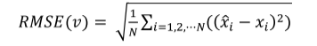
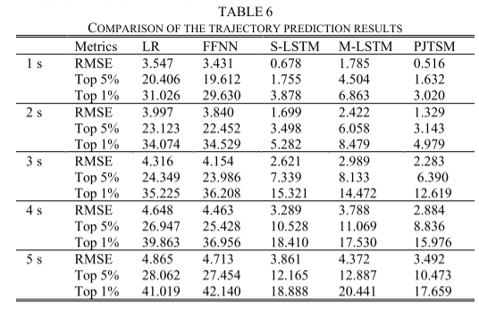
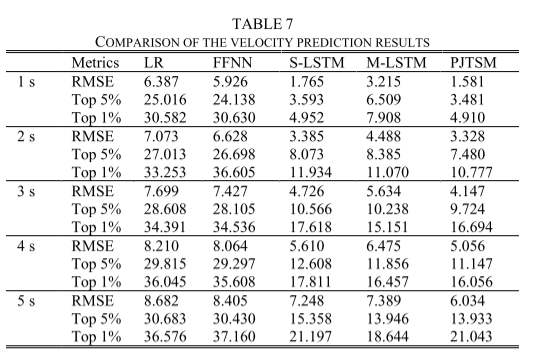
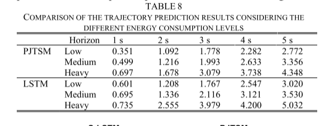
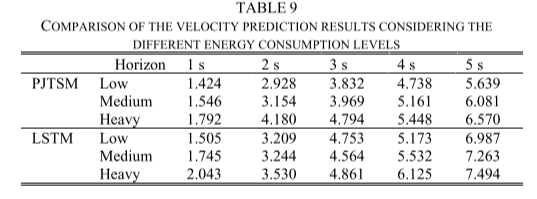

## Toward Safe and Smart Mobility: Energy-Aware  Deep Learning for Driving Behavior Analysis  and Prediction of Connected Vehicles

近年来，互联自动驾驶技术显示出巨大的进步。但是，尚不清楚驾驶行为和能量消耗如何相互关联，以及这些与连接车辆相关的因素在多大程度上可以影响运动预测性能。驾驶行为的精确识别和车辆运动的预测对于互联自动车 (CAVs) 的驾驶安全性至关重要。因此，在这项研究中，使用基于深度学习的时间序列建模方法，为CAVs提出了一种能量感知的驾驶模式分析和运动预测系统。首先，对能量感知的纵向加速和减速行为以及横向变道行为进行统计分析。然后，应用滑动标准偏差 (SSD) 测试来评估考虑不同能量消耗水平的轨迹和速度信号的平滑度。==提出了一种基于深度递归神经网络 (RNN) 和长短期记忆 (LSTM) 单元的能量感知个性化联合时间序列建模 (PJTSM) 方法，用于领先车辆的精确运动 (轨迹和速度) 预测。==最后，比较和讨论了不同能耗水平下预测性能的差异。结果表明，由于驾驶行为的随机性较高，在这三类汽车中，对重能用户的预测精度最低，这意味着更难预测表现出重能消耗的汽车的驾驶行为。对CAVs驾驶行为的个性化估计将有助于更安全的自动驾驶和运输系统。

#### 数据：

PJTSM网络使用==NGSIM数据集==进行训练。具体而言，使用US-101和I-80高速公路驾驶数据。

#### 评估指标：

计算均方根误差（RMSE）来评估预测性能。此外，报告了最差1%和5%情况下的平均RMSE。

#### 模型输入和输出：

该模型以领先车辆的==历史运动数据为输入==，==输出预测的轨迹和速度状态。==

#### 结论：

提出了基于能量感知PJTSM方法的车辆轨迹和速度运动预测方法。PJTSM网络显示了其在领先汽车运动预测中的效率和准确性。

对不同能耗水平的预测精度进行了研究和比较。 结果表明，高能耗行为会导致较大的状态预测误差。

